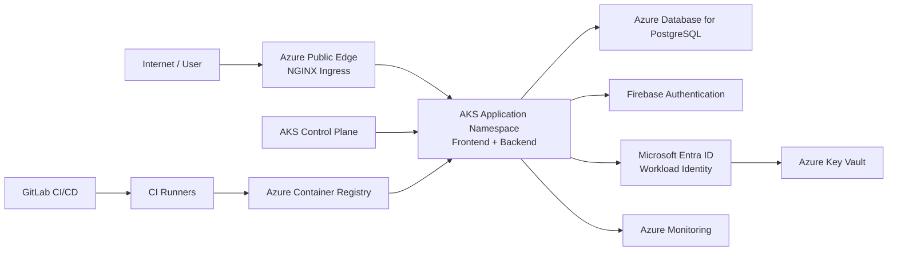

````markdown
# ApplicationBib / Ritual Growth — Azure Migration Architecture Overview

## 1. Purpose

This document describes how the existing ApplicationBib / Ritual Growth DevSecOps project would be migrated from the current local Minikube environment to Microsoft Azure.

This is a **migration and learning architecture**.

It does not represent an Azure environment that has actually been deployed.

The original project remains unchanged. All Azure-specific migration artifacts are isolated under:

`azure-migration/`

The current local Minikube architecture remains the source of truth for the existing implementation.

---

# 2. Migration Scope

## Current environment

The existing application runs locally using:

- Minikube
- Kubernetes
- NGINX Ingress Controller
- Cloudflare Quick Tunnel
- Spring Boot backend
- Next.js / React frontend
- PostgreSQL
- HashiCorp Vault
- Vault Agent Injector
- Prometheus
- kube-state-metrics
- Grafana
- Loki
- Grafana Alloy
- Alertmanager
- Terraform
- GitLab CI/CD
- GitLab Container Registry
- Podman / Buildah / Skopeo

## Azure target

The migration target introduces:

- Azure Kubernetes Service (AKS)
- Azure Container Registry (ACR)
- Azure Virtual Network
- Azure Key Vault
- Microsoft Entra ID
- AKS Workload Identity
- Azure Database for PostgreSQL Flexible Server
- Azure Monitor
- Log Analytics Workspace
- Azure Monitor Workspace
- Managed Prometheus
- Container Insights
- Azure Monitor Alerts / Action Groups

NGINX Ingress remains part of the target Kubernetes architecture.

---

# 3. Important Architecture Decisions

The migration intentionally does not reproduce every local component inside Azure.

The target architecture uses Azure-managed services where they provide an equivalent managed capability.

| Current component | Azure target |
|---|---|
| Minikube | AKS |
| Local Kubernetes networking | Azure VNet + AKS networking |
| Cloudflare Quick Tunnel | Azure public ingress/load-balancer exposure |
| GitLab Container Registry | Azure Container Registry |
| Vault | Azure Key Vault |
| Vault Kubernetes Auth | Entra ID + AKS Workload Identity |
| Vault Agent Injector | Secrets Store CSI Driver |
| PostgreSQL StatefulSet | Azure Database for PostgreSQL Flexible Server |
| Local Prometheus | Azure Managed Prometheus |
| Local kube-state-metrics | Azure Monitor / managed Kubernetes monitoring |
| Local Loki + Alloy | Azure Monitor / Container Insights + Log Analytics |
| Local Alertmanager | Azure Monitor Alerts + Action Groups |
| Grafana | Can be retained or replaced with Azure-native visualization |
| Local Terraform | Azure migration artifacts are documented separately; no Azure Terraform is currently used |

These are migration targets, not deployed resources.

---

# 4. Complete Azure Target Architecture

```mermaid
flowchart TB

    USER["Internet / User"]

    subgraph AZ["Microsoft Azure"]

        subgraph NET["Azure Network"]

            VNET["Azure VNet<br/>10.20.0.0/16"]

            NSG["Network Security Group"]

            subgraph AKS["Azure Kubernetes Service (AKS)"]

                INGRESS["NGINX Ingress Controller"]

                subgraph APPNS["applicationbib namespace"]

                    FRONTEND["Ritual Growth<br/>Next.js / React"]

                    BACKEND["ApplicationBib<br/>Spring Boot"]

                    APP_SA["applicationbib-azure-sa<br/>Workload Identity"]

                    APP_SERVICE["ApplicationBib Service<br/>ClusterIP"]

                    FRONT_SERVICE["Ritual Growth Service<br/>ClusterIP"]

                    CSI_APP["Secrets Store CSI Driver"]

                end

                subgraph MON["Azure / Kubernetes Monitoring"]

                    PROM["Managed Prometheus"]

                    KSM["Kubernetes monitoring / state metrics"]

                    CONTAINER["Container Insights"]

                end

            end

            subgraph IDENTITY["Azure Identity"]

                ENTRA["Microsoft Entra ID"]

                AKS_WI["AKS Workload Identity"]

                AKS_MI["AKS Managed Identity"]

                APP_MI["ApplicationBib Managed Identity"]

            end

            subgraph SECURITY["Azure Security"]

                KV["Azure Key Vault"]

                CSI["Azure Key Vault Provider<br/>for Secrets Store CSI Driver"]

            end

            subgraph DATA["Managed Database"]

                PG["Azure Database for<br/>PostgreSQL Flexible Server"]

            end

            subgraph OBS["Azure Observability"]

                LAW["Log Analytics Workspace"]

                AMW["Azure Monitor Workspace"]

                ALERTS["Azure Monitor Alerts"]

                ACTIONS["Action Groups"]

            end

            ACR["Azure Container Registry"]

        end

    end

    FIREBASE["Firebase Authentication"]

    USER -->|HTTPS| INGRESS

    INGRESS -->|"/"| FRONT_SERVICE
    INGRESS -->|"/api/*"| APP_SERVICE

    FRONT_SERVICE --> FRONTEND
    APP_SERVICE --> BACKEND

    FRONTEND -->|Firebase Web SDK| FIREBASE
    FIREBASE -->|Firebase ID Token| FRONTEND

    FRONTEND -->|"Authorization: Bearer <ID token>"| INGRESS

    BACKEND -->|Firebase Admin SDK<br/>verifyIdToken()| FIREBASE
    BACKEND -->|SQL| PG

    ENTRA --> AKS_WI
    AKS_WI --> APP_MI

    APP_SA --> AKS_WI
    APP_MI --> KV
    CSI_APP --> CSI
    CSI --> KV
    CSI --> BACKEND

    BACKEND -->|"/mnt/secrets-store/firebase.json"| CSI_APP

    AKS_MI -->|AcrPull| ACR
    AKS -->|Pull images| ACR

    VNET --> AKS
    NSG --> VNET

    BACKEND -->|"/actuator/prometheus"| PROM
    KSM --> PROM

    BACKEND --> CONTAINER
    FRONTEND --> CONTAINER
    INGRESS --> CONTAINER

    CONTAINER --> LAW

    AMW --> ALERTS
    ALERTS --> ACTIONS

    TF["Azure Migration CLI / IaC Documentation"]

    TF -.-> VNET
    TF -.-> AKS
    TF -.-> ACR
    TF -.-> KV
    TF -.-> LAW
    TF -.-> AMW
    TF -.-> APP_MI
````

> **Accuracy note:** The diagram represents the migration target. It does not mean these Azure resources currently exist.

---

# 5. Runtime Request Flow

The main application request path is:

```text
Internet / User
      |
      | HTTPS
      v
NGINX Ingress
      |
      +----------------------------+
      |                            |
      | /                          | /api/*
      v                            v
Ritual Growth                 ApplicationBib
Next.js / React               Spring Boot
                                   |
                                   v
                             PostgreSQL
```

The frontend and backend remain separate workloads.

The frontend does not communicate directly with PostgreSQL.

The backend is responsible for application data access.

---

# 6. Firebase Authentication Flow

Firebase Authentication remains the application authentication provider.

The target flow is:

```text
User
  |
  v
Next.js / React
  |
  v
Firebase Web SDK
  |
  v
Firebase Authentication
  |
  v
Firebase ID Token
  |
  v
Next.js / React
  |
  | Authorization: Bearer <Firebase ID token>
  v
NGINX Ingress
  |
  v
ApplicationBib
Spring Boot
  |
  v
Firebase Admin SDK
  |
  v
Firebase token verification
```

The backend continues to verify the Firebase ID token using:

```text
FirebaseAuth.getInstance().verifyIdToken(idToken)
```

Cloudflare is not used as the authentication provider in the Azure target.

Azure networking also does not replace Firebase Authentication.

---

# 7. User Registration Flow

Registration remains a frontend-to-Firebase operation:

```text
User
  |
  v
Next.js / React
  |
  v
Firebase Web SDK
  |
  v
Firebase Authentication
```

Application-specific information can then be sent to:

```text
Next.js / React
      |
      v
ApplicationBib
      |
      v
Azure Database for PostgreSQL
```

Firebase Authentication and PostgreSQL therefore remain separate systems.

---

# 8. Frontend Firebase Configuration

The frontend Firebase Web configuration remains a **build-time configuration flow**.

It is not moved to Azure Key Vault.

```text
GitLab CI/CD Variables
        |
        v
Buildah --build-arg
        |
        v
Frontend Dockerfile ARG
        |
        v
Dockerfile ENV
        |
        v
npm run build
        |
        v
Next.js production image
        |
        v
React + Firebase Web SDK
        |
        v
Firebase Authentication
```

The following values are supplied during the frontend image build:

```text
NEXT_PUBLIC_FIREBASE_API_KEY
NEXT_PUBLIC_FIREBASE_AUTH_DOMAIN
NEXT_PUBLIC_FIREBASE_PROJECT_ID
NEXT_PUBLIC_FIREBASE_STORAGE_BUCKET
NEXT_PUBLIC_FIREBASE_MESSAGING_SENDER_ID
NEXT_PUBLIC_FIREBASE_APP_ID
```

These are Firebase Web configuration values.

They must not be confused with the Firebase Admin service-account credential.

---

# 9. Firebase Admin Credential Flow

The backend Firebase Admin credential is sensitive.

The Azure target replaces Vault injection with Azure Key Vault + Workload Identity + Secrets Store CSI Driver.

```text
Azure Key Vault
      |
      v
Azure Key Vault Provider
      |
      v
Secrets Store CSI Driver
      |
      v
ApplicationBib Pod
      |
      v
/mnt/secrets-store/firebase.json
      |
      v
FIREBASE_CREDENTIALS
      |
      v
Firebase Admin SDK
      |
      v
Firebase
```

The actual private key value is never represented in the architecture documentation.

---

# 10. Azure Workload Identity

The backend uses a dedicated Kubernetes ServiceAccount:

`applicationbib-azure-sa`

The identity relationship is:

```text
ApplicationBib Pod
       |
       v
applicationbib-azure-sa
       |
       v
AKS Workload Identity
       |
       v
Federated Identity Credential
       |
       v
ApplicationBib Managed Identity
       |
       v
Azure Key Vault
```

This avoids placing long-lived Azure client secrets inside the application pod.

The intended trust relationship uses:

```text
AKS OIDC issuer
+
Kubernetes ServiceAccount
+
Federated Identity Credential
```

with the Azure token exchange audience:

`api://AzureADTokenExchange`

---

# 11. PostgreSQL Architecture

The current environment uses:

```text
Spring Boot
    |
    v
PostgreSQL StatefulSet
    |
    v
PersistentVolume
```

The Azure target uses:

```text
Spring Boot
    |
    | private database connection
    v
Azure Database for PostgreSQL
Flexible Server
```

The PostgreSQL StatefulSet, PostgreSQL Service, and PostgreSQL PVC from the migration learning manifests are therefore **not the target production database architecture**.

They document the Kubernetes-to-managed-database migration concept.

The target database should not be publicly exposed.

---

# 12. PostgreSQL Credentials

The target stores PostgreSQL credentials in Azure Key Vault:

```text
postgres-db
postgres-username
postgres-password
```

The intended flow is:

```text
Azure Key Vault
      |
      v
Secrets Store CSI Driver
      |
      v
ApplicationBib Pod
      |
      v
Spring Boot
      |
      v
Azure Database for PostgreSQL
```

No PostgreSQL password is stored in Git.

---

# 13. Container Registry

The current system builds and publishes images to GitLab Container Registry.

The Azure target uses Azure Container Registry:

```text
GitLab CI/CD
      |
      v
Buildah
      |
      v
Container Image
      |
      v
Azure Container Registry
      |
      v
AKS
```

Target image names:

```text
applicationbibacr.azurecr.io/applicationbib:<tag>

applicationbibacr.azurecr.io/ritual-growth-ui:<tag>
```

The migration uses `applicationbibacr` as the target registry name.

Immutable version tags are preferred over `latest`.

---

# 14. AKS Image Pull Authentication

AKS is intended to use its managed identity to access ACR.

The relationship is:

```text
AKS Managed Identity
        |
        | AcrPull
        v
Azure Container Registry
```

This avoids storing registry passwords inside Kubernetes.

---

# 15. Frontend Deployment

The Azure target frontend is a Kubernetes Deployment:

```text
AKS
 |
 +-- applicationbib namespace
       |
       +-- ritual-growth-ui Deployment
       |
       +-- ritual-growth-ui Service
```

The Service remains internal:

`type: ClusterIP`

NGINX Ingress exposes the application externally.

---

# 16. Backend Deployment

The backend target is:

```text
AKS
 |
 +-- applicationbib namespace
       |
       +-- applicationbib Deployment
       |
       +-- applicationbib Service
```

The backend Service remains:

`type: ClusterIP`

The backend is not directly exposed to the Internet.

Traffic reaches it through NGINX Ingress.

---

# 17. Azure Ingress

The target keeps NGINX Ingress.

The local exposure:

```text
Internet
   |
   v
Cloudflare Quick Tunnel
   |
   v
NGINX Ingress
```

is replaced by an Azure-native public entry point.

Target:

```text
Internet
   |
   v
Azure public endpoint / Load Balancer
   |
   v
NGINX Ingress
   |
   +--------------------------+
   |                          |
   | /                        | /api/*
   v                          v
Frontend                  Backend
```

The exact public hostname is intentionally represented as:

`<AZURE_APPLICATION_HOST>`

No real domain is assumed.

---

# 18. TLS

The target ingress configuration expects:

`https://<AZURE_APPLICATION_HOST>/`

for the frontend and:

`https://<AZURE_APPLICATION_HOST>/api/*`

for the backend.

The Kubernetes Ingress references:

`applicationbib-tls`

as its TLS secret.

The migration documentation does not claim that this certificate has actually been provisioned in Azure.

Certificate provisioning is a deployment-time task.

---

# 19. Network Architecture

The target network uses:

```text
Azure VNet
10.20.0.0/16
```

with an AKS subnet:

```text
10.20.0.0/22
```

The intended AKS networking configuration uses Azure CNI Overlay.

The target address ranges are:

```text
VNet:
10.20.0.0/16

AKS subnet:
10.20.0.0/22

Pod CIDR:
10.244.0.0/16

Service CIDR:
10.30.0.0/16

DNS service IP:
10.30.0.10
```

An Azure Network Security Group is also part of the target network design.

---

# 20. Network Segmentation

The main logical separation is:

```text
Internet
   |
   v
Azure public endpoint
   |
   v
NGINX Ingress
   |
   v
Kubernetes Services
   |
   +-------------------+
   |                   |
   v                   v
Frontend             Backend
                       |
                       v
              PostgreSQL
```

The database is intended to remain private.

The backend is the only application component that communicates with PostgreSQL.

---

# 21. Kubernetes Network Policies

The migration manifests include NetworkPolicies.

The backend policy allows the backend to communicate with:

```text
PostgreSQL :5432
DNS :53
HTTPS :443
```

The PostgreSQL policy allows:

```text
ApplicationBib
      |
      | TCP 5432
      v
PostgreSQL
```

and monitoring access to the PostgreSQL metrics port where applicable.

These manifests are migration artifacts and have not been applied to an Azure cluster.

---

# 22. Monitoring Architecture

The current local monitoring architecture uses:

```text
Spring Boot
    |
    v
Micrometer / Prometheus instrumentation
    |
    v
/actuator/prometheus
    |
    v
Prometheus
    |
    v
Grafana
```

The Azure target moves toward Azure-managed monitoring.

The conceptual target is:

```text
Application
      |
      v
Azure Monitor / Managed Prometheus
      |
      v
Azure Monitor Workspace
      |
      v
Dashboards / Alerts
```

---

# 23. Application Metrics

The backend continues to expose application metrics through:

`/actuator/prometheus`

The important distinction remains:

```text
Spring Boot
    |
    v
Micrometer / Prometheus instrumentation
    |
    v
/actuator/prometheus
```

is the **metrics producer**.

The monitoring service that collects and stores time-series metrics is separate.

In the Azure target:

```text
Application metrics
        |
        v
Managed Prometheus
        |
        v
Azure Monitor Workspace
```

---

# 24. Kubernetes Metrics

Kubernetes infrastructure and workload state are monitored separately from application instrumentation.

Conceptually:

```text
Kubernetes
     |
     v
Kubernetes monitoring / state metrics
     |
     v
Managed Prometheus / Azure Monitor
```

Metrics include operational information such as:

- pod state
- deployment state
- readiness
- replica state
- container/resource information
- restart information

---

# 25. PostgreSQL Monitoring

The local environment uses PostgreSQL exporter metrics.

The Azure target can use Azure-native PostgreSQL monitoring instead of running the exporter as part of the database workload.

Target:

```text
Azure Database for PostgreSQL
        |
        v
Azure Monitor PostgreSQL monitoring
        |
        v
Azure Monitor
```

Therefore the local PostgreSQL exporter should not be interpreted as mandatory for the Azure managed database.

---

# 26. Logs

The current architecture uses:

```text
Kubernetes containers
       |
       v
Grafana Alloy
       |
       v
Loki
       |
       v
Grafana
```

The Azure target moves toward:

```text
Kubernetes workloads
       |
       v
Container Insights
       |
       v
Log Analytics Workspace
       |
       v
Azure Monitor
```

This separates:

```text
Metrics → Managed Prometheus

Logs → Log Analytics / Container Insights
```

---

# 27. Alerting

The local architecture is:

```text
Prometheus
     |
     v
Alertmanager
     |
     +------> Webhook
     |
     +------> Email
```

The Azure target is:

```text
Managed Prometheus / Azure Monitor
          |
          v
Azure Monitor Alerts
          |
          v
Action Groups
          |
          +------> Webhook
          |
          +------> Email
```

The distinction remains important:

- Prometheus generates/evaluates metric-based alerts.
- Alerting infrastructure routes notifications.
- Notification delivery is not performed directly by the metrics storage component.

---

# 28. Terraform / Infrastructure-as-Code

The existing local project uses Terraform to manage infrastructure and monitoring resources.

The Azure migration intentionally keeps Azure artifacts separate.

The current migration workspace does not introduce Azure Terraform.

The migration learning flow is instead documented through Azure CLI configuration and Kubernetes manifests.

Conceptually, the target infrastructure consists of:

```text
Azure configuration
       |
       v
Resource Group
       |
       +-- VNet
       |
       +-- AKS
       |
       +-- ACR
       |
       +-- Key Vault
       |
       +-- Log Analytics
       |
       +-- Azure Monitor Workspace
       |
       +-- Managed PostgreSQL
```

The existing local Terraform configuration is not modified by this migration exercise.

---

# 29. CI/CD Architecture

## Backend

The backend pipeline remains security-focused.

```text
GitLab
   |
   v
Docker CI Runner
   |
   +-- Gitleaks
   +-- Semgrep
   +-- SonarQube
   +-- Snyk
   +-- JUnit / Mockito
   +-- Hadolint
   +-- Maven
   +-- Syft
   +-- Trivy
   |
   v
Container Image
   |
   v
Registry
```

Deployment-oriented stages then perform:

```text
Kubernetes validation
        |
        v
Security validation
        |
        v
Pre-deployment checks
        |
        v
Deployment
        |
        v
Rollout verification
        |
        v
Smoke tests
        |
        v
OWASP ZAP
```

---

# 30. Frontend CI/CD Architecture

The frontend pipeline remains separate.

```text
GitLab
   |
   v
Docker CI Runner
   |
   +-- Gitleaks
   +-- Semgrep
   +-- npm audit
   +-- Snyk
   +-- TypeScript
   +-- ESLint
   +-- Next.js build
   +-- Hadolint
   +-- Buildah
   +-- Syft
   +-- Trivy
   +-- Grype
   +-- Skopeo
   |
   v
Azure Container Registry
```

The Firebase Web configuration remains part of the build process.

---

# 31. Frontend Build-Time Security Boundary

The Firebase Web configuration path is:

```text
GitLab CI/CD Variables
        |
        v
Buildah
        |
        v
Dockerfile ARG
        |
        v
Dockerfile ENV
        |
        v
npm run build
        |
        v
Next.js image
```

This is a **build-time configuration flow**.

It must not be confused with runtime secret injection.

There is no:

```text
Azure Key Vault
      |
      v
Frontend
```

dependency for the Firebase Web configuration.

---

# 32. CI/CD to Azure Registry

The target image flow is:

```text
GitLab Repository
       |
       v
GitLab CI/CD
       |
       v
Security Gates
       |
       v
Buildah
       |
       v
Container Image
       |
       v
Azure Container Registry
       |
       v
AKS
```

Kubernetes retrieves the approved container image from ACR.

The target architecture prefers immutable image tags.

---

# 33. CI Runner Trust Boundary

The CI architecture has two distinct execution environments in the existing backend pipeline.

### Docker executor

Used for application/security/build jobs.

```text
GitLab
   |
   v
Docker Runner
   |
   +-- Security scanners
   +-- Tests
   +-- Maven
   +-- Image build
```

### Local Kubernetes shell executor

Used for local cluster operations.

```text
GitLab
   |
   v
Shell Runner
   |
   +-- kubectl
   +-- Podman
   +-- Minikube
   +-- Terraform
   +-- Vault
   +-- Rollouts
   +-- Smoke tests
   +-- OWASP ZAP
```

The Azure migration does not claim that this existing local runner architecture has been converted to an Azure deployment runner.

---

# 34. Trust Boundaries

The major trust boundaries are:

```text
[TB1] Internet / User
        |
        v
[TB2] Azure Public Edge / Ingress
        |
        v
[TB3] Kubernetes Application Namespace
        |
        +---- Frontend
        |
        +---- Backend
        |
        v
[TB4] Managed PostgreSQL

[TB5] Firebase External Service

[TB6] Azure Identity
        |
        v
[TB7] Azure Key Vault

[TB8] Kubernetes Control Plane

[TB9] Monitoring / Observability

[TB10] GitLab CI/CD

[TB11] Container Registry

[TB12] CI Runner Environment
```

---

# 35. Trust-Boundary Diagram



Each transition represents a trust or security boundary that should be considered during threat modeling.

---

# 36. Sensitive Assets

The migration must protect:

## Authentication

- Firebase ID tokens
- Firebase authentication information
- authenticated user identity

## Backend secrets

- Firebase Admin service-account credential
- PostgreSQL credentials
- Azure identity permissions

## Infrastructure

- Azure credentials
- GitLab CI/CD credentials
- ACR permissions
- Kubernetes credentials
- workload identity configuration

## Data

- PostgreSQL application data
- application logs
- monitoring data
- alert destinations

No real secret values are stored in this documentation.

---

# 37. STRIDE Threat Summary

| Component          | STRIDE threats | Primary concern                                 |
| ------------------ | -------------- | ----------------------------------------------- |
| Internet / User    | S, T, D        | Account abuse, malicious requests, DoS          |
| Azure Edge         | S, T, D        | Traffic manipulation or service exhaustion      |
| NGINX Ingress      | S, T, D, E     | Request manipulation and exposed attack surface |
| Frontend           | T, I, D        | Client-side manipulation and token exposure     |
| Firebase           | S, T, I        | Account/token compromise                        |
| Backend            | S, T, I, E     | Authentication bypass and API abuse             |
| PostgreSQL         | T, I, D, E     | Unauthorized data access                        |
| Key Vault          | S, I, E        | Secret disclosure or unauthorized access        |
| Workload Identity  | S, E           | Identity impersonation                          |
| AKS                | S, T, I, D, E  | Cluster compromise                              |
| ACR                | T, I, E        | Malicious image or unauthorized pull            |
| GitLab CI/CD       | T, I, E        | Pipeline compromise                             |
| CI runners         | T, I, E        | Runner compromise                               |
| Managed Prometheus | T, I, D        | Metric manipulation or exposure                 |
| Azure Monitor      | I, T, D        | Observability data exposure                     |
| Alerting           | T, D, I        | False/missed alerts or endpoint exposure        |

---

# 38. Implemented Security Controls

The existing project already implements several security controls.

These include:

- Firebase-based application authentication
- backend Firebase ID-token verification
- Spring Security
- non-root containers
- UID/GID 10001
- Linux capability dropping
- read-only root filesystems where implemented
- temporary writable `/tmp` through `emptyDir`
- Kubernetes NetworkPolicies
- Vault-based backend secret injection
- CI secrets scanning
- SAST
- dependency scanning
- container scanning
- SBOM generation
- Dockerfile linting
- Kubernetes manifest validation
- Kubernetes security scoring
- automated tests
- rollout verification
- smoke testing
- OWASP ZAP
- monitoring
- logging
- alerting
- Terraform-managed local infrastructure
- dedicated workload identities in the Azure migration design

---

# 39. Azure Security Improvements

The migration introduces or targets the following Azure security capabilities:

- Azure Key Vault
- Entra ID
- AKS Workload Identity
- federated identity credentials
- managed identities
- Azure RBAC
- ACR pull authorization
- private PostgreSQL connectivity
- Azure network segmentation
- NSGs
- managed monitoring
- centralized logging
- Azure-native alerting

These are migration targets and are not currently deployed.

---

# 40. Residual Risks

The following risks remain relevant even after migration.

## Public application exposure

The application will still have a public entry point.

Controls should include:

- TLS
- ingress hardening
- request limits
- secure headers
- appropriate network restrictions

## Firebase token theft

A stolen Firebase ID token could be used by an attacker until it expires or is otherwise invalidated.

Controls include:

- HTTPS
- secure frontend implementation
- backend token verification
- avoiding token logging
- avoiding sensitive information in browser storage where possible

## CI/CD compromise

A compromised CI runner or pipeline could produce a malicious image.

Existing controls reduce this risk but do not eliminate it.

Additional future improvements could include:

- GitLab OIDC to Azure
- protected branches
- protected variables
- signed images
- image provenance
- admission policies
- deployment authorization

## Container registry compromise

A compromised registry or compromised credentials could allow malicious images to reach AKS.

Recommended future controls include:

- immutable tags
- image signing
- provenance verification
- least-privilege ACR permissions
- admission controls

## Kubernetes compromise

AKS remains a significant security boundary.

Recommended controls include:

- RBAC
- least-privilege ServiceAccounts
- NetworkPolicies
- pod security controls
- regular cluster upgrades
- workload identity
- restricted administrative access

## Monitoring data exposure

Logs and metrics can contain operational or application information.

Future controls should include:

- access control
- retention policies
- log sanitization
- avoiding tokens/secrets in logs
- least-privilege monitoring permissions

---

# 41. What Is Actually Implemented vs Migration Target

## Implemented locally

The existing project has:

```text
Minikube
Kubernetes
NGINX
Cloudflare Quick Tunnel
Spring Boot
Next.js / React
PostgreSQL
Vault
Vault Agent Injector
Prometheus
Grafana
Loki
Grafana Alloy
Alertmanager
Terraform
GitLab CI/CD
GitLab Container Registry
Podman / Buildah / Skopeo
```

## Azure migration artifacts

The migration workspace contains planning/manifests/configuration for:

```text
AKS
Azure VNet
ACR
Azure Key Vault
Workload Identity
Managed identities
Azure Monitor
Log Analytics
Azure Monitor Workspace
Managed PostgreSQL
Azure-native alerting
Azure target Kubernetes manifests
```

## Not currently deployed

No Azure production migration has been performed.

In particular:

- no new AKS cluster has been created
- no new ACR has been created
- no new Key Vault has been created
- no Azure PostgreSQL database has been created
- no Azure monitoring workspace has been created
- no Azure application deployment has been performed
- no production secrets have been copied to Azure
- no production database has been migrated
- no Azure ingress has been deployed

The Azure subscription is currently unavailable for resource creation.

---

# 42. Existing Azure Subscription Constraint

The migration environment was prepared as a learning exercise.

The Azure subscription is currently disabled/read-only for resource creation.

Therefore the Azure infrastructure scripts and manifests are treated as:

```text
Migration design
+
Deployment preparation
+
Learning artifacts
```

rather than as a live Azure deployment.

No unrelated Azure resources should be modified.

---

# 43. Existing Project Protection

The original project is intentionally preserved.

The migration workspace is:

`azure-migration/`

Azure-specific files are kept separate from:

```text
terraform/
k8s/
src/
Dockerfile
.gitlab-ci.yml
```

The existing local Terraform configuration is not modified for the Azure exercise.

The existing Kubernetes architecture remains unchanged.

The separate Ritual Growth frontend repository is also not modified as part of this migration documentation exercise.

---

# 44. Migration Sequence

A real Azure migration would logically proceed in the following order.

## Phase 1 — Azure foundation

Create:

```text
Resource Group
VNet
AKS subnet
NSG
```

## Phase 2 — Container platform

Create:

```text
AKS
ACR
```

Configure:

```text
AKS → ACR AcrPull
```

## Phase 3 — Identity

Configure:

```text
Entra ID
AKS Workload Identity
OIDC issuer
Federated credentials
Managed identities
Azure RBAC
```

## Phase 4 — Secrets

Create:

```text
Azure Key Vault
```

Populate only the required secrets:

```text
firebase-service-account
postgres-db
postgres-username
postgres-password
```

## Phase 5 — Database

Provision:

```text
Azure Database for PostgreSQL Flexible Server
```

Configure private connectivity.

Only then migrate application data if required.

## Phase 6 — Kubernetes

Install/configure:

```text
NGINX Ingress
Secrets Store CSI Driver
Azure Key Vault provider
NetworkPolicies
Application workloads
```

## Phase 7 — Monitoring

Configure:

```text
Azure Monitor
Log Analytics
Managed Prometheus
Azure Monitor Workspace
Container Insights
Alerts
```

## Phase 8 — Application deployment

Push:

```text
applicationbib:<immutable-tag>
ritual-growth-ui:<immutable-tag>
```

to ACR.

Deploy the workloads to AKS.

## Phase 9 — Validation

Perform:

```text
kubectl rollout status
health checks
authentication tests
API smoke tests
database connectivity tests
secret injection tests
monitoring verification
alert verification
security validation
OWASP ZAP
```

---

# 45. Migration Validation Checklist

Before declaring the Azure migration operational:

## Application

- [ ] Frontend loads over HTTPS
- [ ] Backend is reachable through `/api`
- [ ] Firebase registration works
- [ ] Firebase login works
- [ ] Firebase ID tokens are accepted by the backend
- [ ] Invalid tokens are rejected
- [ ] Backend can access PostgreSQL

## Secrets

- [ ] Application identity authenticates through Workload Identity
- [ ] Key Vault access works
- [ ] Firebase Admin credential is mounted
- [ ] PostgreSQL credentials are available securely
- [ ] No credentials are committed to Git

## Networking

- [ ] Backend is not publicly exposed directly
- [ ] PostgreSQL is private
- [ ] NGINX routes `/` correctly
- [ ] NGINX routes `/api/*` correctly
- [ ] NetworkPolicies behave as intended
- [ ] TLS works correctly

## Containers

- [ ] Images are pulled from ACR
- [ ] Immutable image tags are used
- [ ] Containers run as non-root
- [ ] Capabilities are dropped
- [ ] Read-only filesystem controls work
- [ ] Resource limits are configured

## Monitoring

- [ ] Application metrics are collected
- [ ] Kubernetes metrics are collected
- [ ] PostgreSQL monitoring works
- [ ] Container logs are available
- [ ] Alerts trigger correctly
- [ ] Notification channels work

## Security

- [ ] CI security gates pass
- [ ] Image scans pass
- [ ] Kubernetes validation passes
- [ ] Authentication testing passes
- [ ] OWASP ZAP passes
- [ ] Azure identities follow least privilege

---

# 46. Final Architecture Summary

The migration changes the infrastructure platform while preserving the application's core architecture.

The central runtime model remains:

```text
User
 |
 v
Frontend
 |
 +----------------------+
 |                      |
 v                      v
Firebase              Backend
Authentication        Spring Boot
                         |
                         v
                    PostgreSQL
```

The Azure infrastructure becomes:

```text
Azure
 |
 +-- AKS
 |    |
 |    +-- NGINX Ingress
 |    |
 |    +-- Frontend
 |    |
 |    +-- Backend
 |
 +-- ACR
 |
 +-- Key Vault
 |
 +-- Managed PostgreSQL
 |
 +-- Azure Monitor
 |
 +-- Log Analytics
 |
 +-- Entra ID / Workload Identity
 |
 +-- VNet / NSG
```

The security model becomes:

```text
Firebase
    |
    v
Application authentication

Entra ID
    |
    v
Workload identity

Key Vault
    |
    v
Application secrets

AKS
    |
    v
Application runtime

ACR
    |
    v
Trusted container images
```

The observability model becomes:

```text
Application / Kubernetes
        |
        +---- Metrics ----> Managed Prometheus
        |
        +---- Logs -------> Container Insights
                                |
                                v
                         Log Analytics
        |
        +---- Alerts -----> Azure Monitor
                                |
                                v
                           Action Groups
```

The CI/CD model remains:

```text
GitLab
   |
   v
Security Gates
   |
   v
Build
   |
   v
SBOM / Image Scanning
   |
   v
ACR
   |
   v
AKS
```

---

# 47. Final Accuracy Statement

This document intentionally distinguishes between:

### Runtime architecture

The systems that serve users and process application data.

### Build-time configuration

The process that supplies frontend Firebase Web configuration during the Next.js build.

### Secret-management flow

The backend's sensitive Firebase Admin credential and database credentials.

### Monitoring flow

Metrics, logs, and alerts.

### CI/CD flow

Security scanning, image creation, registry publishing, and deployment.

### Migration target

The Azure services that would replace or augment the current local infrastructure.

No Azure component described as a migration target should be interpreted as already deployed.

Most importantly:

```text
Vault → Frontend
```

is **not** part of the architecture.

The frontend Firebase Web configuration continues to originate from GitLab CI/CD build variables.

Likewise:

```text
Firebase Web SDK
```

and:

```text
Firebase Admin SDK
```

remain separate responsibilities.

The final target therefore preserves the application's security model while replacing local infrastructure with Azure-managed equivalents where appropriate.

```

You can save that directly as `azure-migration/architecture/azure-migration-overview.md`.
```
