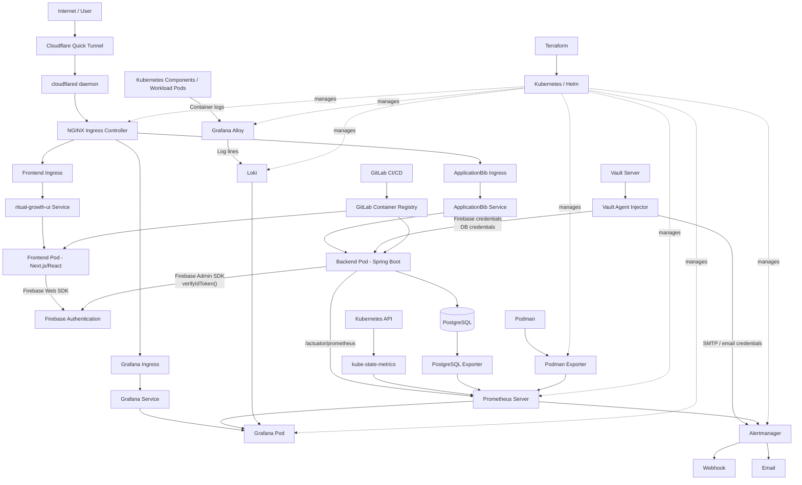
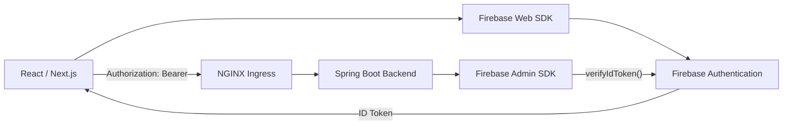
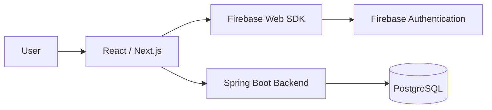
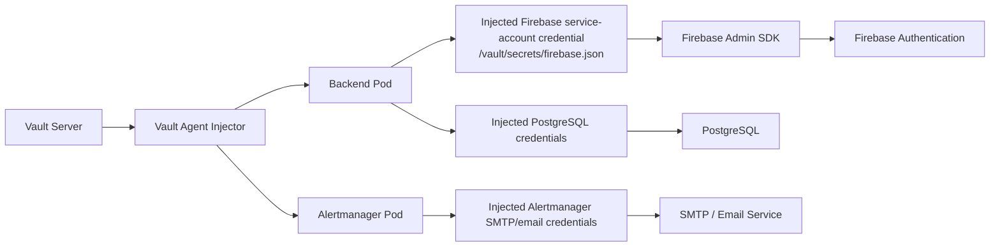
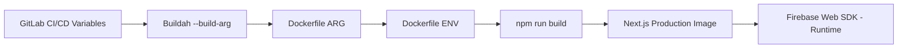
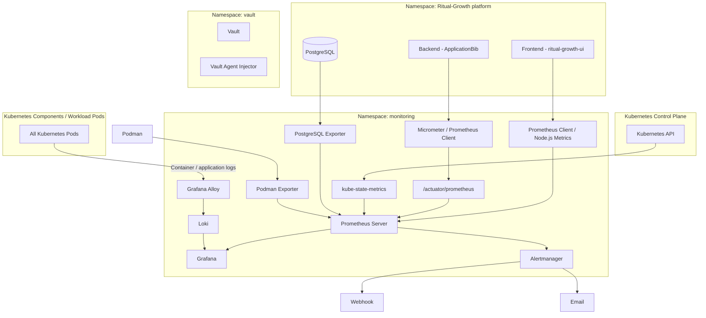
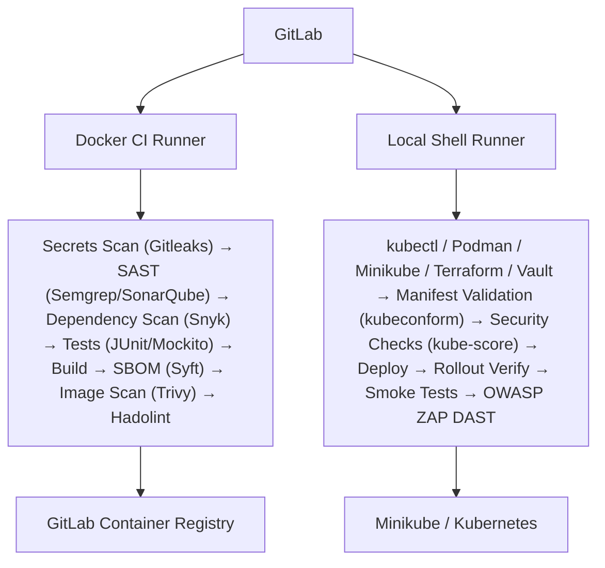
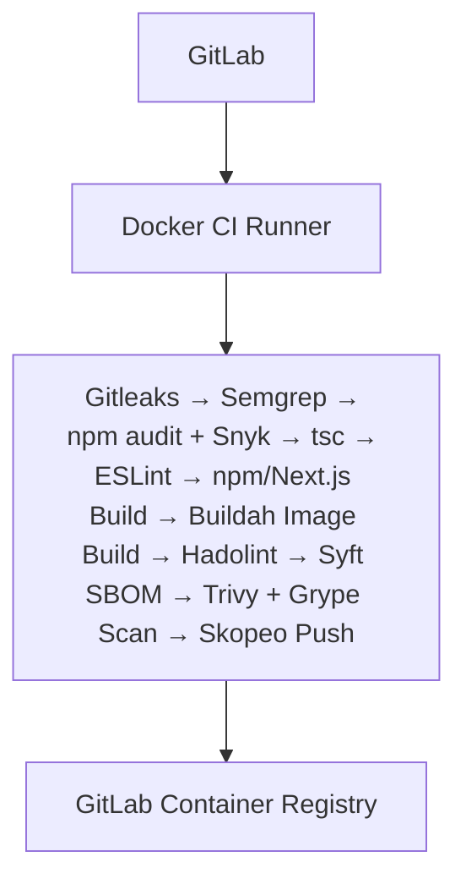
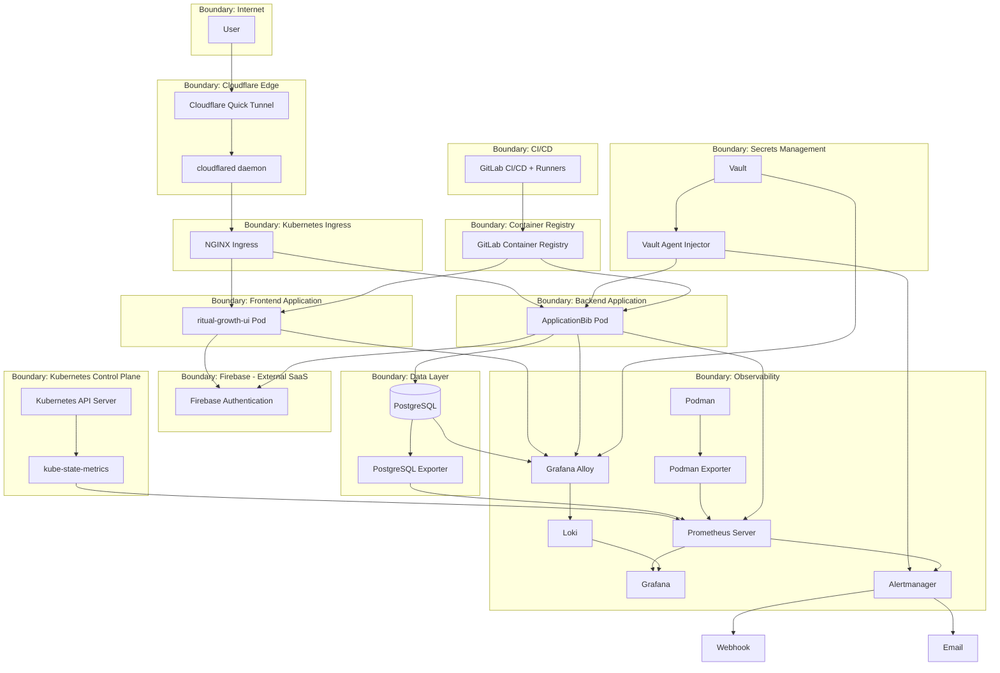

# Ritual Growth / ApplicationBib — DevSecOps Threat Model & Architecture Documentation

**Status:** Living document — reflects the *actual implemented system* as of this writing, not an idealized target architecture.

**Scope:** Frontend (`ritual-growth-ui`), Backend (`applicationbib`), Firebase Authentication, PostgreSQL, HashiCorp Vault, Kubernetes (Minikube), Cloudflare Quick Tunnel, monitoring/observability stack, CI/CD (GitLab), and Terraform-managed infrastructure.

### Container Tooling

The project uses daemonless container tooling throughout the container lifecycle:

- **Podman** — daemonless container runtime and container management.
- **Buildah** — daemonless OCI image building.
- **Skopeo** — daemonless container image inspection and transfer between registries.

From a security perspective, the daemonless model reduces reliance on a
privileged long-running container daemon. These tools complement, but do not
replace, dedicated security controls such as Trivy, Snyk, Gitleaks, Semgrep,
kube-score, and kubeconform.

---

## 1. System Overview

Ritual Growth is a two-service web application:

- **Frontend** — Next.js 15.3.3 / React 19 (`ritual-growth-ui`)
- **Backend** — Spring Boot (`applicationbib`)
- **Database** — PostgreSQL
- **Identity provider** — Firebase Authentication (Firebase Web SDK on the frontend, Firebase Admin SDK on the backend)
- **Orchestration** — Kubernetes via Minikube
- **Container tooling** — Podman / Buildah / Skopeo (daemonless, rootless build chain)
- **Ingress** — NGINX Ingress Controller
- **External access** — Cloudflare Quick Tunnel (via the `cloudflared` daemon, managed by its own script — not Terraform)
- **Secrets management** — HashiCorp Vault (Kubernetes auth method, Vault Agent Injector)
- **Observability** — Prometheus Client (Micrometer/Actuator) + Prometheus Server + kube-state-metrics + PostgreSQL Exporter + Grafana + Alertmanager + Grafana Alloy + Loki
- **CI/CD** — GitLab, separate frontend/backend pipelines, GitLab Container Registry
- **IaC** — Terraform

A recurring theme in this document: **Prometheus Client (instrumentation) and Prometheus Server are distinct components** and are never merged into a single "Prometheus" box.

---

## 2. Frontend Architecture

Repository: `ritual-growth-ui`
Stack: Next.js 15.3.3, React 19, Firebase Web SDK 11.9.1

`src/lib/firebase.ts` initializes the Firebase Web SDK using:

- `NEXT_PUBLIC_FIREBASE_API_KEY`
- `NEXT_PUBLIC_FIREBASE_AUTH_DOMAIN`
- `NEXT_PUBLIC_FIREBASE_PROJECT_ID`
- `NEXT_PUBLIC_FIREBASE_STORAGE_BUCKET`
- `NEXT_PUBLIC_FIREBASE_MESSAGING_SENDER_ID`
- `NEXT_PUBLIC_FIREBASE_APP_ID`

Firebase Authentication is used client-side for registration, login, auth-state tracking, ID token retrieval, and logout. The frontend obtains a token via `firebaseUser.getIdToken()` and sends it to the backend as:

```
Authorization: Bearer <Firebase ID token>
```

### 2.1 Important — Frontend Firebase Configuration Source

**The frontend does NOT receive Firebase Web configuration from Vault.** There is no `Vault → Vault Agent Injector → Frontend → Firebase Web` flow, and the `firebase-web` Vault path is not an active frontend dependency (see §6.1).

Production Firebase Web config flows through the build pipeline instead:

```
GitLab CI/CD Variables
  → Buildah --build-arg
    → Frontend Dockerfile ARG
      → Dockerfile ENV
        → npm run build
          → Next.js production image
            → React + Firebase Web SDK
              → Firebase Authentication
```

The frontend Dockerfile declares `ARG` entries for every `NEXT_PUBLIC_FIREBASE_*` value, converts them to `ENV`, and only then runs `npm run build`. GitLab CI passes these values in via `--build-arg`. `.env.local` is used only for local development.

**Build-time configuration** (`GitLab CI variables → Buildah --build-arg → Dockerfile → Next.js build`) is a distinct concern from **runtime Firebase usage** (`React/Next.js → Firebase Web SDK → Firebase Authentication`), and both are shown separately throughout this document.

**Not a confidentiality concern.** Because these are `NEXT_PUBLIC_*` values, Next.js bakes them into the client-side JavaScript bundle by design — they are visible to anyone who loads the app, the same way any Firebase Web SDK config is. They must **not** be treated or documented as confidential secrets, and their presence in GitLab CI/CD variables is a build-input concern, not a Vault-grade secret-custody concern. The actual security control that matters here is **Firebase project/API-key restrictions and Firebase Security Rules** (i.e., what an API key/project ID is allowed to do once known), not hiding the values from the browser.

---

## 3. Frontend Registration & Application Data Flow

Registration/authentication:

```
User → Next.js/React → Firebase Web SDK → Firebase Authentication
```

Application data (separate concern, separate system):

```
React/Next.js → Spring Boot Backend → PostgreSQL
```

Firebase Authentication is the identity system; PostgreSQL is the application data store. They are independent systems — Firebase credentials and Firebase service-account private keys are **never** stored in PostgreSQL.

---

## 4. Backend Architecture

Stack: Spring Boot, Maven, Spring Security, Firebase Admin SDK, PostgreSQL client, Spring Boot Actuator.

The backend receives `Authorization: Bearer <Firebase ID token>` from the frontend (via NGINX Ingress) and verifies it in a Firebase authentication filter using the Firebase Admin SDK:

```java
FirebaseAuth.getInstance().verifyIdToken(idToken)
```

Authentication flow:

```
Frontend → Firebase ID Token → NGINX Ingress → Spring Boot → Firebase Admin SDK → Firebase Authentication
```

Post-authentication data access:

```
Spring Boot → PostgreSQL
```

Requests with invalid/missing tokens are rejected per the implemented Spring Security configuration.

---

## 5. Vault Architecture

HashiCorp Vault runs inside Kubernetes with:

- Vault Server
- Vault Agent Injector
- Kubernetes auth method

Vault is used to securely provide runtime credentials to workloads that require them.

Active secret-consumption flows include:

- Backend Pod:
  - Firebase service-account credential
  - PostgreSQL credentials
- Alertmanager Pod:
  - SMTP/email credentials used for alert notifications

The Vault Agent Injector authenticates the workload through the Kubernetes auth
method and injects the required secrets into the corresponding pod.

Conceptually:
```
Vault Server
  → Vault Agent Injector
    → Backend Pod
       → Firebase credentials
       → PostgreSQL credentials
```
```
Vault Server
  → Vault Agent Injector
    → Alertmanager Pod
       → SMTP/email credentials
```

No secret values are reproduced anywhere in this document. The Firebase service-account private key is **not** stored in the GitLab repository, the frontend, the browser, PostgreSQL, or any container image — only injected at runtime into the backend pod's filesystem by Vault.

### 5.1 Important Vault Distinction — `firebase-web`

A Vault path/secret named `firebase-web` may exist, but based on the current deployed state:

- The frontend Deployment has **no** Vault Agent annotations.
- The frontend pod has **no** `/vault/secrets` directory.
- The frontend receives Firebase config from GitLab CI/CD build arguments, not Vault.

**`firebase-web` is therefore an unused/stale Vault path, not an active architecture component.** It must not be drawn as `Vault → firebase-web → Frontend` in any production data flow.

---

## 6. Kubernetes Architecture

Platform: **Minikube**

Representative workloads:

- `applicationbib` (backend) Deployment
- `ritual-growth-ui` (frontend) Deployment
- PostgreSQL
- NGINX Ingress Controller
- Vault + Vault Agent Injector
- Prometheus(client & server), kube-state-metrics, PostgreSQL Exporter, Podman Exporter
- Grafana, Alertmanager
- Loki, Grafana Alloy

Namespaces: `default`, `monitoring`, `vault`, `ingress-nginx`, `kube-system`.

The Kubernetes control plane (API server, scheduler, controller-manager, `kube-system`) is treated as a distinct trust domain from application workloads running in `default`/`monitoring`/`vault`.

---

## 7. External Access — Cloudflare Quick Tunnel

```
External User → Cloudflare HTTPS (edge) → Cloudflare Quick Tunnel → cloudflared → Minikube → NGINX Ingress Controller → Kubernetes Services → Frontend/Backend/Grafana
```

`cloudflared` is the local daemon that establishes and maintains the outbound connection from the Minikube host to Cloudflare's edge for the Quick Tunnel — it is a distinct runtime component from the Quick Tunnel itself and is started/managed by its own documented script (see §10; Terraform does not manage it).

The Cloudflare Quick Tunnel exposes the local Minikube ingress externally without directly exposing a backend NodePort to the public Internet. Cloudflare is purely a network-edge/tunneling component — it performs **no** Firebase application authentication. Firebase Authentication remains the sole application-level authentication mechanism.

---

## 8. NGINX Ingress Routing

```
Cloudflare Quick Tunnel → NGINX Ingress Controller → ApplicationBib Ingress → ApplicationBib Service → ApplicationBib Pod
Cloudflare Quick Tunnel → NGINX Ingress Controller → Frontend Ingress → ritual-growth-ui Service → ritual-growth-ui Pod
Cloudflare/internal access → NGINX Ingress Controller → Grafana Ingress → Grafana Service → Grafana Pod
```

NGINX performs HTTP(S) routing only; it does not authenticate Firebase users.

---

## 9. Monitoring & Observability Architecture

Each telemetry pipeline below is independent and is never collapsed into a single generic "monitoring" arrow.

### 9.1 Application Metrics (Prometheus Client vs. Prometheus Server)

The Spring Boot backend uses **Micrometer / Spring Boot Actuator Prometheus support** — this is the Prometheus **client**/instrumentation side, living *inside* the application:

```text
Spring Boot Application → Micrometer / Prometheus instrumentation → /actuator/prometheus
```

The Prometheus **Server** (a separate Kubernetes-deployed component) scrapes this endpoint, stores time series, and evaluates alerting rules:

```text
/actuator/prometheus → Prometheus Server
```

Prometheus Server is never embedded inside Spring Boot, and the instrumentation endpoint is never called "the Prometheus Server."

### 9.2 Kubernetes State Metrics

```text
Kubernetes API → kube-state-metrics → Prometheus Server
```

kube-state-metrics exposes pod/deployment/replica/readiness/restart/resource-state information — it is not Prometheus itself.

### 9.3 Frontend Monitoring

The frontend has no custom `/metrics` endpoint scraped by Prometheus Server. What is confirmed is Node.js process-level telemetry surfaced for the `ritual-growth-ui` pod:

- CPU usage
- Memory usage
- Node.js heap used
- Node.js heap total
- Event-loop lag
- Active Node.js handles
- Active Node.js requests

A Terraform-provisioned Grafana dashboard for `ritual-growth-ui` contains **seven panels**, one per metric above. There is currently no confirmed request-rate or error-rate metric for the frontend; that wording has been removed and should only be reinstated if findings/configuration later prove such metrics exist.

### 9.4 PostgreSQL Metrics

```text
PostgreSQL → PostgreSQL Exporter → Prometheus Server → Grafana
```

PostgreSQL never sends metrics directly to Grafana.

### 9.5 Podman Host Metrics

The solution also uses **Podman Exporter** to expose Podman host/container metrics to Prometheus:

```text
Podman → Podman Exporter → Prometheus Server → Grafana
```

Podman Exporter provides infrastructure-level observability for the Podman environment. It is separate from PostgreSQL Exporter and kube-state-metrics.

### 9.6 Grafana

```text
Prometheus Server → Grafana
Loki → Grafana
```

Grafana dashboards cover backend metrics, frontend infrastructure metrics, PostgreSQL metrics, Podman infrastructure metrics, Kubernetes metrics, and logs via Loki. The `ritual-growth-ui` seven-panel dashboard is provisioned and managed by Terraform.

### 9.7 Alertmanager

```text
Prometheus Server → Alertmanager → Webhook
Prometheus Server → Alertmanager → Email
```

Alertmanager performs routing, grouping, and notification delivery. It does not generate application metrics, and Prometheus never emails directly — Alertmanager mediates all notification delivery.

### 9.8 Grafana Alloy & Loki (Logs)

Grafana Alloy discovers Kubernetes pods and collects their container logs:

```text
Kubernetes workload pods → Grafana Alloy → Loki → Grafana
```

The current Alloy configuration uses Kubernetes pod discovery and does not restrict collection to only the frontend, backend, or PostgreSQL pods.

**Prometheus = metrics. Loki = logs.** Loki never stores Prometheus time series; Prometheus never stores application logs. Alloy is a distinct log-shipping component, not the Prometheus Server.

### 9.9 Consolidated Observability Pipelines

| Pipeline | Flow |
|---|---|
| Application metrics | Spring Boot → Micrometer/Prometheus Client → `/actuator/prometheus` → Prometheus Server → Grafana |
| Kubernetes state metrics | Kubernetes API → kube-state-metrics → Prometheus Server → Grafana |
| PostgreSQL metrics | PostgreSQL → PostgreSQL Exporter → Prometheus Server → Grafana |
| Podman metrics | Podman → Podman Exporter → Prometheus Server → Grafana |
| Container logs | Kubernetes workload pods → Grafana Alloy → Loki → Grafana |
| Alerts | Prometheus Server → Alertmanager → Webhook / Email |
---

## 10. Terraform / Infrastructure as Code

Terraform manages Kubernetes resources, Helm releases, the NGINX ingress release, the kube-prometheus-stack, Loki, Grafana configuration/dashboards, ServiceMonitors, and general monitoring configuration:

```
Terraform → Kubernetes/Helm → Infrastructure + Monitoring Stack
```

Terraform is infrastructure-as-code applied out-of-band from request traffic — it is **not** a runtime dependency of the frontend or backend.

**Terraform does not manage the Cloudflare Quick Tunnel.** The tunnel (and the `cloudflared` process that maintains it — see §7) is started and managed by its own separate, documented script, outside of Terraform's scope. Terraform's remit is limited to the Kubernetes/Helm-deployed resources listed above; it must not be drawn or described as provisioning or controlling the Quick Tunnel.

---

## 11. Backend CI/CD Architecture

Build tooling is daemonless/container-based: Buildah, Podman, Skopeo
Two GitLab runner types are used.

### 11.1 Docker CI Runner (build/security validation)

Executor: **Docker**
Tools: Maven, JUnit, Mockito, Gitleaks, Semgrep, SonarQube, Snyk, Syft, Trivy, Hadolint

```
GitLab → Docker CI Runner → Build/Security Validation → GitLab Container Registry
```

### 11.2 Local Kubernetes Shell Runner (deploy/runtime verification)

Executor: **Shell**
Tools: kubectl, Podman, Minikube, Terraform, Vault, Kubernetes rollout checks, smoke tests, OWASP ZAP, Prometheus/Grafana verification

```
GitLab → Local Shell Runner → Minikube/Kubernetes
```

### 11.3 Backend Pipeline Stages

1. Secrets scanning (Gitleaks)
2. SAST (Semgrep, SonarQube)
3. Dependency scanning (Snyk)
4. Unit/integration tests (JUnit, Mockito, Maven)
5. Linting
6. Build
7. SBOM generation (Syft)
8. Container image scanning (Trivy)
9. Kubernetes manifest validation (kubeconform)
10. Kubernetes security validation (kube-score)
11. Pre-deployment checks
12. Deployment
13. Rollout verification
14. Post-deployment smoke tests
15. OWASP ZAP DAST

---

## 12. Frontend CI/CD Architecture

Executor: **Docker**. Build tooling is daemonless/container-based: Buildah, Podman, Skopeo.

| Stage | Tool |
|---|---|
| Secrets scanning | Gitleaks |
| SAST | Semgrep |
| Dependency scanning | npm audit + Snyk |
| Typecheck | `tsc` |
| Lint | ESLint |
| Build | npm / Next.js |
| Image build | Buildah |
| Dockerfile linting | Hadolint |
| SBOM | Syft |
| Image scanning | Trivy + Grype |
| Image push | Skopeo |

### 12.1 Frontend Firebase CI/CD Configuration (explicit)

```
GitLab CI/CD Variables → Buildah --build-arg → Dockerfile ARG → Dockerfile ENV → npm run build → Next.js production image → React + Firebase Web SDK → Firebase Authentication
```

Vault and the Vault Agent Injector are **not** part of this flow, and `firebase-web` is **not** an active dependency in it.

---

## 13. Container Registry

```
GitLab CI → Buildah → Container Image → GitLab Container Registry
GitLab Container Registry → Kubernetes → Backend Pod
GitLab Container Registry → Kubernetes → Frontend Pod
```

---

## 14. Complete Runtime Authentication Flow

```
User → React/Next.js → Firebase Web SDK → Firebase Authentication → (Firebase ID Token)
Frontend → Authorization: Bearer <Firebase ID Token> → NGINX Ingress → Spring Boot Backend → Firebase Admin SDK → Firebase Authentication
```

Verification: `FirebaseAuth.getInstance().verifyIdToken(idToken)`. Invalid/missing tokens are rejected per the implemented Spring Security configuration.

```
Spring Boot → PostgreSQL
```

---

## 15. Trust Boundaries

1. Internet / external user
2. Cloudflare edge/tunnel
3. Kubernetes ingress (NGINX)
4. Frontend application (`ritual-growth-ui` pod)
5. Backend application (`applicationbib` pod)
6. Firebase managed services (external SaaS)
7. PostgreSQL
8. Vault
9. Kubernetes control plane
10. Monitoring/observability stack
11. GitLab CI/CD
12. Container registry
13. CI runners (Docker executor / local Shell executor)

---

## 16. Sensitive Assets

- Firebase service-account credentials
- PostgreSQL database credentials
- Alertmanager SMTP/email credentials
- Firebase ID tokens
- User authentication information
- PostgreSQL application data
- Vault secrets and policies

**Not treated as a confidential asset:** the `NEXT_PUBLIC_FIREBASE_*` Web config values. They are passed through GitLab CI/CD as build arguments, but they end up embedded in the public client bundle by design and are not secrets — see §2.1. They are listed here only for completeness of the CI/CD variable inventory, not because they require secrecy; the relevant control is Firebase project/API-key restriction, tracked separately.
- Container registry credentials
- Kubernetes credentials (kubeconfig, service account tokens)
- CI runner credentials
- Monitoring data (metrics, dashboards)
- Application logs (Loki)
- Alert notification endpoints (webhook URL, email config)
- Terraform state/configuration

No credentials, tokens, private keys, or secret values are reproduced in this document.

---

## 17. Required Diagrams

### A. Complete System Architecture



### B. Authentication Architecture



### C. Registration Architecture



### D. Vault Architecture



### E. Frontend Build Configuration



### F. Monitoring Architecture



### G. Backend CI/CD



### H. Frontend CI/CD



### I. Trust Boundary Diagram



---

## 18. Component Table

| Component | Technology | Role | Data Handled | Trust Boundary | Security Relevance |
|---|---|---|---|---|---|
| Frontend app | Next.js 15.3.3 / React 19 | User-facing UI, auth initiation | UI state, Firebase ID token (in-browser) | Frontend application | XSS, token handling, build-time configuration |
| Firebase Web SDK | Firebase JS SDK 11.9.1 | Client-side authentication calls | Firebase API key, auth tokens | Frontend / Firebase boundary | Public API key exposure is expected but must be scoped correctly |
| Firebase Authentication | Firebase (SaaS) | Identity provider | Credentials, ID tokens | Firebase managed services | External dependency; token forgery/replay risk if mishandled |
| Backend app | Spring Boot / Maven | API, business logic, token verification | Firebase ID tokens, application data | Backend application | Central enforcement point for authentication and authorization |
| Firebase Admin SDK | Firebase Admin Java SDK | Server-side token verification | Firebase service-account credential | Backend / Firebase boundary | Credential compromise could grant privileged Firebase access |
| PostgreSQL | PostgreSQL | Application data store | User/application records, database credentials | Data layer | SQL injection, data exposure, credential protection |
| Vault Server | HashiCorp Vault | Secrets management | Firebase, PostgreSQL, and Alertmanager/SMTP credentials | Secrets boundary | Central secret custody; policy misconfiguration risk |
| Vault Agent Injector | Vault Kubernetes Injector | Runtime secret injection | Injected secret files | Secrets boundary / Workloads | Injector misconfiguration could expose secrets to unintended workloads |
| NGINX Ingress | NGINX Ingress Controller | L7 routing into cluster | HTTP(S) traffic | Ingress boundary | Misrouting, ingress misconfiguration, TLS handling |
| Cloudflare Quick Tunnel | Cloudflare Tunnel | External edge/tunnel | Inbound HTTP traffic | Internet / Cloudflare boundary | Provides external access but does not provide application-level authentication |
| `cloudflared` daemon | Cloudflare Tunnel client | Maintains outbound tunnel connection | Tunnel traffic in transit | Cloudflare edge / Minikube host boundary | Host/process compromise could affect external access |
| Prometheus Client (Micrometer) | Micrometer / Spring Boot Actuator | Application metrics instrumentation | Internal application metrics | Backend application | Metrics endpoint exposure if unauthenticated |
| Prometheus Server | Prometheus | Metrics scrape, storage, and alert evaluation | Time-series metrics | Monitoring boundary | Unauthorized scrape/query/configuration access |
| kube-state-metrics | kube-state-metrics | Kubernetes object-state metrics | Cluster object metadata | Monitoring / Kubernetes API boundary | Exposes cluster topology and workload state |
| PostgreSQL Exporter | postgres_exporter | PostgreSQL metrics exposition | Database performance metrics | Monitoring / Database boundary | Exporter permissions or exposure could leak database metadata |
| Podman | Podman | Daemonless container engine used by CI/runtime tooling | Container images, containers, build artifacts | CI / container runtime boundary | Daemonless architecture reduces reliance on a privileged long-running Docker daemon |
| Buildah | Buildah | Container image building | Source code, build context, image layers | CI / build boundary | Rootless/daemonless image builds reduce container-runtime attack surface |
| Skopeo | Skopeo | Container image transfer and registry operations | Container images, registry credentials | CI / registry boundary | Enables controlled image copying/inspection without requiring a container daemon |
| Grafana | Grafana | Dashboards and visualization | Metrics and logs | Monitoring boundary | Dashboard, datasource, and authentication access control |
| Alertmanager | Alertmanager | Alert routing and notification | Alert payloads, SMTP configuration | Monitoring boundary | Notification credential protection and alert-routing security |
| Grafana Alloy | Grafana Alloy | Cluster-wide container log collection and forwarding | Container/application logs from workloads | Monitoring boundary | Sensitive data may enter logs; collector configuration requires protection |
| Loki | Loki | Log aggregation and storage | Container/application logs | Monitoring boundary | Unauthorized log access or ingestion could expose sensitive information |
| GitLab CI/CD | GitLab | Pipeline orchestration | Source code, CI variables, secrets, artifacts | CI/CD boundary | Pipeline injection, variable exposure, and supply-chain risks |
| GitLab Container Registry | GitLab Registry | Container image storage | Built container images | Registry boundary | Image tampering and unauthorized push/pull access |
| Local Shell Runner | GitLab Shell executor | Deployment and runtime verification | kubeconfig, Vault credentials/tokens, Terraform state | CI runner boundary | Broad blast radius; compromise could affect Kubernetes, Vault, and infrastructure |
| Terraform | Terraform | Infrastructure as code | Kubernetes/Helm configuration, monitoring configuration, state | IaC boundary | State sensitivity, configuration tampering, and excessive apply permissions |

---

## 19. Data Flow Table

| Flow | Source | Destination | Data | Purpose | Trust Boundary Crossed |
|---|---|---|---|---|---|
| 1 | User | Cloudflare Quick Tunnel | HTTP(S) request | Access app | Internet → Cloudflare edge |
| 2 | Cloudflare Quick Tunnel | `cloudflared` daemon | Tunneled HTTP(S) | Forward traffic to Minikube host | Cloudflare edge → Minikube host |
| 3 | `cloudflared` daemon | NGINX Ingress | Tunneled HTTP(S) | Route traffic into the cluster | Minikube host → Ingress |
| 4 | NGINX Ingress | Frontend Pod | HTTP request | Serve the frontend application | Ingress → Frontend app |
| 5 | Frontend | Firebase Authentication | Credentials / ID token requests | Register and authenticate users | Frontend → Firebase (external) |
| 6 | Frontend | Backend | Bearer ID token + application request | Access application API | Frontend → Backend app |
| 7 | Backend | Firebase Authentication | ID token verification request | Validate Firebase identity | Backend → Firebase (external) |
| 8 | Backend | PostgreSQL | SQL queries | Persist and retrieve application data | Backend → Data layer |
| 9 | Vault Server | Vault Agent Injector | Authorized secret data | Provide secrets to authorized workloads | Secrets boundary → Kubernetes workload |
| 10 | Vault Agent Injector | Backend Pod | Firebase service-account credentials + PostgreSQL credentials | Inject backend runtime credentials | Secrets boundary → Backend app |
| 11 | Vault Agent Injector | Alertmanager Pod | SMTP/email credentials | Inject credentials required for email alert delivery | Secrets boundary → Monitoring |
| 12 | Backend / Spring Boot / Micrometer Prometheus Client | `/actuator/prometheus` | Prometheus-formatted application metrics | Expose application metrics for scraping | Backend application |
| 13 | Prometheus Server | `/actuator/prometheus` | Metrics scrape request/response | Collect and store application metrics | Monitoring → Backend application |
| 14 | PostgreSQL | PostgreSQL Exporter | Database statistics | Expose PostgreSQL metrics | Data layer → Monitoring |
| 15 | Kubernetes API | kube-state-metrics | Kubernetes object state | Expose cluster/workload state metrics | K8s control plane → Monitoring |
| 16 | Kubernetes workload pods | Grafana Alloy | Container/application log lines | Discover and collect Kubernetes pod logs | Application/Data/Monitoring layers → Monitoring |
| 17 | Grafana Alloy | Loki | Kubernetes pod/container log lines | Centralize and store logs for the Kubernetes solution | Monitoring internal |
| 18 | Prometheus Server | Grafana | Metric queries | Visualize metrics and dashboards | Monitoring internal |
| 19 | Loki | Grafana | Log queries | Visualize application/container logs | Monitoring internal |
| 20 | Prometheus Server | Alertmanager | Fired alerts | Route and manage alerts | Monitoring internal |
| 21 | Alertmanager | Webhook endpoint | Alert notification | Deliver webhook notifications | Monitoring → External system |
| 22 | Alertmanager | SMTP/Email service | Alert notification + SMTP-authenticated connection | Deliver email notifications | Monitoring → External system |
| 23 | GitLab | CI Runners (Docker/Shell) | Pipeline jobs, CI variables | Build, test, validate, deploy, and verify | CI/CD boundary |
| 24 | CI (Docker Runner) | GitLab Container Registry | Built container image | Store container artifacts | CI/CD → Registry |
| 25 | GitLab Container Registry | Kubernetes (Backend/Frontend Pods) | Container image pull | Deploy application workloads | Registry → Runtime |

---

## 20. STRIDE Threat Table

| Component | Spoofing | Tampering | Repudiation | Information Disclosure | Denial of Service | Elevation of Privilege |
|---|---|---|---|---|---|---|
| Frontend | Malicious client impersonating the legitimate application or phishing clone | Malicious modification of frontend code or CI/CD build inputs | Limited ability to prove client-side actions originated from a legitimate user/device | Firebase `NEXT_PUBLIC_*` configuration is intentionally public; risk arises if Firebase project/API-key restrictions are overly permissive | Client-side resource exhaustion; excessive requests against backend APIs | N/A — frontend has no trusted privileged execution context |
| Firebase Authentication | Credential theft, credential stuffing, session/token replay | Abuse of authentication flows or unauthorized changes to authentication configuration | Limited application-side visibility into Firebase-side authentication events | Firebase ID-token leakage through logs, URLs, referrers, or compromised client storage | Authentication abuse, repeated login attempts, or provider-side rate limiting | Improper custom claims or authorization configuration could grant excessive privileges |
| Firebase Web SDK | Malicious/typosquatted dependency or compromised SDK package | Supply-chain modification of the SDK dependency or malicious frontend integration | N/A — library itself does not provide application auditability | Client-side Firebase configuration is intentionally visible; sensitive tokens must not be exposed through application logging | Malicious or faulty SDK usage causing excessive authentication/API activity | N/A — SDK itself should not grant backend privileges |
| Backend | Forged, expired, revoked, or replayed ID tokens if token verification/validation is bypassed or incorrectly implemented | Manipulated request payloads, parameters, or application state if validation/authorization is insufficient | Insufficient structured authentication/request audit logging may prevent attribution of sensitive actions | Verbose errors, sensitive application responses, or logs exposing internal information | Unbounded/expensive endpoints, request flooding, connection exhaustion, or resource exhaustion | Broken authorization allowing horizontal or vertical privilege escalation |
| Firebase Admin SDK | N/A — server-side library | Tampering with the service-account credential or SDK dependency | N/A | Disclosure of the service-account credential could grant broad Firebase project capabilities depending on IAM permissions | N/A | Compromise of the service-account credential could provide the privileges assigned to that service account |
| PostgreSQL | Unauthorized DB connection using stolen credentials | SQL injection, unauthorized writes, or malicious data modification | Insufficient DB-level audit logging may prevent attribution of database changes | Data exfiltration through injection, unauthorized queries, backups, or excessive DB grants | Expensive/unbounded queries, connection exhaustion, or storage exhaustion | Overly broad DB roles/grants allowing unauthorized administrative actions |
| Vault | Unauthorized workload impersonating an authorized Kubernetes service account | Vault policy/configuration tampering | Vault audit logging is not yet centralized | Overly broad policies could expose Firebase, PostgreSQL, or Alertmanager credentials | Vault unavailability blocking secret retrieval on pod startup/restart | Excessive Vault policy scope could expose credentials belonging to other workloads |
| Vault Agent Injector | Malicious pod attempting to obtain secret injection using an unauthorized or compromised Kubernetes identity | Unauthorized modification of injector configuration, annotations, templates, or injected-secret handling | Injector activity may be difficult to attribute without centralized audit logging | Secret injection into an unintended or compromised pod/filesystem | Injector failure can block application startup when injected secrets are required | Overly broad injector RBAC could allow unauthorized secret injection behavior |
| Kubernetes (Minikube) | Compromised kubeconfig, service-account token, or workload identity | Unauthorized modification of Kubernetes resources, manifests, or configuration | Limited Kubernetes audit logging in Minikube can reduce attribution of administrative actions | Over-privileged workloads may read Secrets, ConfigMaps, pod metadata, or cluster information | Resource exhaustion without sufficient limits/quotas or workload isolation | Excessive RBAC permissions can allow namespace or cluster-level privilege escalation |
| NGINX Ingress | Host-header manipulation, ingress-rule confusion, or routing abuse | Unauthorized modification of Ingress resources or annotations | Incomplete ingress access logs can make request attribution difficult | Misrouting or exposed routes could reveal internal services | Connection floods or excessive request volume at the ingress layer | Over-scoped ingress-controller RBAC could enable unauthorized cluster actions |
| Cloudflare Quick Tunnel | The tunnel URL itself provides no application identity; anyone who discovers/reaches it can reach the exposed ingress routes | Tunnel configuration or startup-script tampering outside the Kubernetes control plane | Cloudflare-side visibility is external and limited compared with application audit logs | Leakage/discovery of the temporary Quick Tunnel URL exposes the reachable ingress surface | Tunnel/provider throttling or resource exhaustion can affect availability | N/A — Quick Tunnel does not provide application authorization |
| Prometheus Client / Micrometer | N/A — instrumentation library | Metric values could be manipulated if the application process is compromised | N/A | Unauthenticated `/actuator/prometheus` could expose internal application/runtime metrics and metadata | Excessive metric cardinality or expensive instrumentation could increase scrape/storage load | N/A |
| Prometheus Server | Spoofed or unintended scrape targets through incorrect ServiceMonitor/discovery configuration | Metric injection or unauthorized modification of scrape/rule configuration | Limited Prometheus query/audit history can make administrative actions difficult to attribute | Unauthenticated Prometheus UI/API can expose infrastructure and application metrics | High-cardinality metrics, excessive queries, or storage exhaustion | Overly broad Prometheus service-account/RBAC permissions |
| kube-state-metrics | N/A — read-only metrics component | Unauthorized modification of its configuration or scrape exposure | Limited auditability of metric collection configuration | Exposes Kubernetes object state/topology information to consumers with scrape access | Excessive scraping can increase Kubernetes API-server load | Over-scoped Kubernetes API permissions could expose more cluster information than required |
| PostgreSQL Exporter | Spoofed exporter target or unauthorized exporter deployment | Unauthorized modification of exporter configuration | Limited exporter/database auditability | Misconfiguration could expose DB connection information or detailed database performance metadata | Excessive exporter queries could increase database load | Exporter database role broader than required could expose or modify excessive DB information |
| Grafana | Weak or compromised Grafana credentials/session | Unauthorized dashboard, datasource, alert, or configuration modification | Grafana audit/access logging may be incomplete | Dashboards and datasources may expose sensitive metrics or logs to unauthorized users | Expensive dashboard queries or excessive concurrent requests | Over-assigned Grafana administrator privileges |
| Alertmanager | Spoofed alert source | Alert rule/config tampering | No confirmation of notification delivery | Alert content or SMTP credentials could be exposed if configuration/injection is compromised | Alert flood / notification spam | Overly broad Alertmanager/Vault permissions could expose notification credentials |
| Grafana Alloy | Compromised or unauthorized log source/collector | Unauthorized modification of collector configuration or manipulation of collected log streams | Gaps in log collection reduce forensic attribution | Sensitive tokens, credentials, PII, or application data may leak into logs | Excessive log volume can overwhelm Alloy/Loki resources | Over-scoped Alloy permissions could allow unauthorized collection or cluster access |
| Loki | Unauthorized log producer or ingestion client | Unauthorized log ingestion, deletion, or manipulation where permissions allow | Missing/incomplete retention can reduce forensic evidence | Sensitive application/container logs may be readable by unauthorized Grafana users | Log-ingestion floods or storage exhaustion | Over-scoped Loki/Grafana datasource permissions |
| GitLab CI/CD | Compromised GitLab account, token, or pipeline identity | Pipeline definition tampering, malicious merge/push, or unauthorized CI configuration changes | Pipeline/job history provides attribution, but incomplete audit controls may limit forensic certainty | CI/CD variables such as deploy credentials and registry tokens may be exposed through misconfigured jobs; Firebase Web configuration values are non-confidential by design | Pipeline or runner resource exhaustion | Overly broad CI permissions, protected-branch bypass, or unauthorized variable access |
| Container Registry | Unauthorized or spoofed image push | Image replacement/tampering after scanning and before deployment | Registry audit logs may be insufficient for complete attribution if not centrally retained | Registry credentials or private image contents could be exposed | Registry outage can block deployment | Excessive push/pull permissions can enable unauthorized image publication or access |
| Docker CI Runner | Compromised runner registration/token or malicious CI job | Malicious job can modify build output, artifacts, or generated images | CI job logs provide some attribution but can be manipulated by a compromised job | Build-time secrets may be exposed through logs/artifacts if jobs are misconfigured | Malicious jobs can exhaust runner resources | Runner permissions broader than build requirements can increase escalation impact |
| Local Shell Runner | Compromised runner host, credentials, or execution context | Direct host-level modification of Kubernetes, Vault, Terraform, or deployment state | Local execution may lack centralized auditability | Runner has access to kubeconfig, Vault credentials/tokens, Terraform state, and deployment data | Local resource exhaustion can affect Minikube and deployment availability | Broad host/Kubernetes/Vault/Terraform access gives this runner the highest privilege-escalation risk |
| Terraform | Unauthorized identity using Terraform credentials | Unauthorized modification of Terraform configuration/state or infrastructure resources | Apply history/state may not provide complete centralized attribution | Terraform state may contain sensitive infrastructure values | Failed or malicious applies can disrupt infrastructure | Terraform credentials with excessive scope can enable broad infrastructure privilege escalation |

---
## 21. Security Control Mapping

| Threat | Existing Control | Status | Residual Risk | Recommended Improvement |
|---|---|---|---|---|
| Forged/invalid ID tokens reaching backend | Firebase ID-token verification via Firebase Admin SDK (`verifyIdToken`) | Implemented | Invalid or improperly issued tokens are rejected; additional application-level authorization remains important | Add explicit token-revocation checks where required |
| Runtime credential exposure | Vault-managed credentials injected only into workloads that require them via Vault Agent Injector | Implemented | A compromised consuming pod could expose credentials available to that workload | Maintain least-privilege Vault policies and credential/TTL rotation |
| Vault access from arbitrary workloads | Kubernetes authentication with workload-specific Vault roles and least-privilege policies | Implemented | A compromised authorized workload could access secrets permitted to its Vault role | Periodically review and tighten Vault policies |
| Secrets committed to source | Gitleaks in CI/CD pipelines | Implemented | Detection depends on configured rules and scan coverage | Expand and periodically review detection rules |
| Vulnerable/insecure code patterns | Semgrep and SonarQube/SonarCloud | Implemented | Static analysis may miss novel or context-dependent vulnerabilities | Periodically tune rules and complement with DAST |
| Vulnerable dependencies | Snyk for backend/frontend and npm audit for frontend | Implemented | New vulnerabilities can appear after a scan | Scheduled re-scans and dependency-update automation |
| Insecure Dockerfiles | Hadolint | Implemented | Static Dockerfile analysis does not guarantee runtime security | Combine with container/runtime security controls |
| Unknown SBOM composition | Syft | Implemented | SBOM freshness depends on pipeline execution | Attach SBOM/provenance attestations to registry artifacts |
| Vulnerable container images | Trivy and Grype according to pipeline coverage | Implemented | Zero-day vulnerabilities and undiscovered vulnerabilities remain possible | Add image signing and verification with Cosign/Sigstore |
| Invalid/insecure Kubernetes manifests | kubeconform and kube-score | Implemented | Static validation does not provide admission-time enforcement | Add admission-control policy enforcement |
| Runtime application vulnerabilities | OWASP ZAP DAST | Implemented | Current DAST coverage may not exercise all authenticated application flows | Extend DAST to authenticated and deeper application flows |
| Unauthorized public exposure of backend | Cloudflare Quick Tunnel instead of directly exposing the backend NodePort | Implemented | The tunnel URL itself does not provide application-level authentication | Use Cloudflare Access or stronger edge authentication for non-development environments |
| Metrics/logs pipeline confusion | Clear separation between Prometheus metrics and Loki logs; Prometheus instrumentation/client and Prometheus Server are distinct components | Implemented | Monitoring interfaces remain security-sensitive | Strengthen authentication and authorization for monitoring interfaces |
| Overly broad network access between workloads | Kubernetes NetworkPolicies restricting required workload communication | Implemented | Policy coverage must evolve as workloads and communication paths change | Periodically review policies and default-deny coverage |
| Overly broad Kubernetes RBAC | Kubernetes RBAC reviewed and constrained where practical; Vault/Kubernetes authentication requirements considered | Partially implemented / constrained by required Vault integration | Required ServiceAccount/token relationships limit how aggressively permissions can be removed | Continue least-privilege review without breaking required Vault authentication |
| Broad blast radius of local Shell CI runner | Local Shell runner has access to Minikube/Kubernetes, Vault and Terraform for deployment/runtime verification | Recommended / Not fully mitigated | Compromise of the runner host could affect Kubernetes, Vault and Terraform | Use dedicated least-privilege runners/service accounts and reduce runner scope |
| Runtime credential exposure across multiple services | Vault supplies backend Firebase credentials, PostgreSQL credentials, and Alertmanager SMTP credentials through Vault Agent Injector | Implemented | Compromise of an authorized workload could expose the credentials injected into that workload | Continue workload-specific Vault policies and secret rotation |
| Lack of centralized Vault audit trail | Vault audit logging is not currently centralized into the security monitoring pipeline | Recommended / Not implemented | Delayed detection and investigation of Vault misuse | Enable Vault audit logging and centralize relevant audit events |
| Unrestricted access to monitoring UIs | Monitoring access controls are not fully hardened across all monitoring interfaces | Recommended / Not implemented | Sensitive metrics and logs may be accessible to unauthorized users with network access | Enforce authentication and least-privilege access to monitoring interfaces |
| No rate limiting at ingress/application layer | No confirmed application or ingress rate-limiting control | Recommended / Not implemented | Susceptible to request abuse and application-layer DoS | Implement rate limiting at NGINX and/or application layer |
| Unsigned container images | Container images are scanned but not cryptographically signed/verified | Recommended / Not implemented | Supply-chain tampering between build and deployment remains possible | Implement image signing and verification using Cosign/Sigstore |
| Limited CI/CD provenance | CI/CD performs security scanning and artifact generation but does not provide full cryptographic build provenance/attestation | Recommended / Not implemented | Harder to prove artifact origin and build integrity | Add build provenance and artifact attestations |
| Fragmented security event visibility | Prometheus/Loki/Grafana provide operational observability, but centralized security-event correlation is not implemented | Recommended / Not implemented | Security events remain distributed across Kubernetes, Vault, GitLab, ingress and application logs | Centralize security/audit events and correlate them through a dedicated security monitoring capability |
---

## 22. Residual Risks & Future Recommendations

The following items represent **remaining risks or future improvements**. Controls that have already been implemented or explicitly evaluated are not listed here as missing controls.

### Remaining / Future Improvements *(Not currently implemented)*

- Cloudflare Access or stronger edge authentication for non-development environments
- Further refinement of Vault policies where additional least-privilege reduction is practical
- Further Kubernetes RBAC tightening where compatible with the permissions required by Vault Kubernetes authentication and the deployed components
- Dedicated least-privilege CI service accounts, especially for the local Shell runner
- Reducing the blast radius of the local Shell runner
- Vault audit logging and centralized analysis of Vault audit events
- Stronger access controls on Prometheus and Grafana
- Rate limiting at the ingress/application layer
- Image signing and verification using Cosign/Sigstore
- Improved CI/CD provenance and build attestation
- Centralized security audit-event aggregation across infrastructure and security-relevant components
- Centralized security-event detection, correlation, and monitoring

### Implemented / Verified Controls Relevant to These Risks

The following controls have already been implemented or explicitly reviewed and therefore are **not treated as missing controls**:

- Kubernetes NetworkPolicies are implemented to restrict network communication between workloads according to the required application and monitoring flows.
- Vault access is scoped using Kubernetes authentication and workload-specific Vault policies.
- Vault secret TTL controls have been configured.
- The backend's Firebase service-account credentials and PostgreSQL credentials are injected at runtime through the Vault Agent Injector.
- Alertmanager SMTP credentials are also injected at runtime through the Vault Agent Injector rather than being stored directly in the application configuration.
- Kubernetes RBAC has been reviewed and tightened where practical. Further restriction was evaluated against the requirements of Vault Kubernetes authentication; the Kubernetes ServiceAccount/token relationship required by Vault must remain available to workloads that authenticate to Vault.
- Application and infrastructure/container logs are centrally collected by Grafana Alloy and forwarded to Loki, covering the deployed solution components for which pod/container logs are available.
- Prometheus Server → Alertmanager provides centralized operational/metric alert routing to the configured webhook and email destinations.
- Prometheus and Loki remain separate observability systems: Prometheus stores metrics, while Loki stores logs.
- Terraform manages the relevant Kubernetes/Helm monitoring infrastructure and Grafana dashboard provisioning.

These implemented controls still carry residual risk if their policies, permissions, credentials, or underlying workloads are compromised.

---

## 23. Final Summary

1. **Reaching the system:** Users reach Ritual Growth over the Internet via a Cloudflare Quick Tunnel, which forwards traffic to the NGINX Ingress Controller inside the Minikube cluster. NGINX routes requests to the frontend, backend, or Grafana Services according to the configured ingress rules.

2. **Firebase authentication:** The frontend uses the Firebase Web SDK for registration, login, and session/token management. The backend independently verifies each request's Firebase ID token server-side using the Firebase Admin SDK (`verifyIdToken`).

3. **Frontend configuration:** Production Firebase Web configuration values are injected at build time through GitLab CI/CD variables, passed to the container build process as build arguments, and exposed through Dockerfile `ARG`/`ENV` variables for the Next.js production build. Vault plays no role in this frontend configuration path. Because these are `NEXT_PUBLIC_*` values, they are configuration values rather than confidential secrets.

4. **Backend credential protection:** The backend's sensitive credentials are managed by HashiCorp Vault and injected at runtime into the backend pod through the Vault Agent Injector using Kubernetes authentication. This includes the Firebase service-account credentials and PostgreSQL database credentials. The credentials are not stored in the frontend, source repository, or container image.


5. **Application data:** After authentication, the backend reads and writes application data directly to PostgreSQL. Firebase Authentication and PostgreSQL are separate systems and are not represented as a linear authentication-to-database chain.

6. **Metrics:** Application metrics flow from Micrometer/Spring Boot Actuator (`/actuator/prometheus`) to Prometheus Server. Kubernetes state metrics flow through kube-state-metrics, PostgreSQL metrics flow through the PostgreSQL Exporter, and container/runtime metrics are collected through the configured monitoring exporters. These metrics converge on Prometheus Server and are queried by Grafana.

7. **Frontend monitoring:** The confirmed frontend monitoring consists of CPU usage, memory usage, Node.js heap used, Node.js heap total, event-loop lag, active Node.js handles, and active Node.js requests. These metrics are represented in the Terraform-provisioned seven-panel `ritual-growth-ui` Grafana dashboard. No unverified frontend request-rate or error-rate metrics are claimed.

8. **Logs:** Grafana Alloy is responsible for collecting container/application logs from the deployed solution components and forwarding them to Loki. Loki provides centralized log storage and querying, while Grafana provides log visualization. Prometheus is therefore treated as the metrics system, while Loki is the log storage/query system.

9. **Alerts and Alertmanager credentials:** Prometheus Server evaluates alerting rules and sends fired alerts to Alertmanager. Alertmanager performs notification routing to the configured webhook and email destinations. Alertmanager's SMTP credentials are stored in HashiCorp Vault and injected at runtime through the Vault Agent Injector. Prometheus does not directly perform email notification delivery.


10. **Terraform:** Terraform manages the Kubernetes/Helm infrastructure and monitoring configuration, including ingress, kube-prometheus-stack, Loki, Grafana dashboards, ServiceMonitors, exporters, and related monitoring resources. Terraform is an infrastructure-as-code control-plane tool and is not a runtime dependency of the frontend or backend.

11. **Cloudflare:** The Cloudflare Quick Tunnel and its `cloudflared` daemon are managed separately through the documented tunnel script and are not managed by Terraform. The Quick Tunnel provides external access to the Minikube ingress without directly exposing the backend NodePort to the public Internet. Firebase remains responsible for application-level authentication.

12. **Network security:** Kubernetes NetworkPolicies have been implemented to restrict workload communication according to the required application, database, Vault, and observability flows. Residual risk remains from explicitly permitted communication paths and from compromise of an allowed workload.

13. **Vault security:** HashiCorp Vault is used as the central secret-management system for sensitive runtime credentials. The Vault Agent Injector injects secrets into the workloads that require them, including the backend's Firebase service-account and PostgreSQL credentials and Alertmanager's SMTP credentials. Vault Kubernetes authentication, workload-scoped policy controls, and secret TTL controls are implemented. Further policy refinement and centralized Vault audit logging remain possible improvements.

14. **Kubernetes RBAC:** Kubernetes RBAC has been reviewed and tightened where practical. Stricter restrictions were evaluated against the requirements of Vault Kubernetes authentication. Workloads that authenticate to Vault require the relevant Kubernetes ServiceAccount/token relationship, so disabling or removing those required permissions indiscriminately would break the Vault authentication flow.

15. **CI/CD supply-chain security:** The CI/CD pipelines perform source, dependency, build, container, and Kubernetes security validation. Security controls include Gitleaks, Semgrep, SonarQube/SonarCloud, Snyk, npm audit where applicable, automated tests, Hadolint, Syft, Trivy, Grype, kubeconform, kube-score, and OWASP ZAP as applicable to each pipeline.

    Container tooling includes:
    - Podman — daemonless container runtime and container management.
    - Buildah — daemonless OCI container image building.
    - Skopeo — daemonless container image inspection and transfer.

    These tools support the container lifecycle but are not considered substitutes for dedicated security controls such as vulnerability scanning, SAST, secret scanning, SBOM generation, and Kubernetes security validation.

16. **Implemented observability:** The implemented observability stack consists of Micrometer/Spring Boot Actuator, Prometheus Server, kube-state-metrics, PostgreSQL Exporter, Podman/container monitoring exporters where configured, Grafana, Alertmanager, Grafana Alloy, and Loki. Terraform manages the relevant monitoring infrastructure, exporters, ServiceMonitors, and Grafana dashboards.

17. **Implemented security controls:** Firebase ID-token authentication and server-side verification, Vault-managed and runtime-injected Firebase/PostgreSQL/SMTP credentials, Kubernetes-authenticated Vault access, Vault TTL controls, Kubernetes NetworkPolicies, reviewed/tightened RBAC, secrets/SAST/dependency/container scanning, SBOM generation, Dockerfile linting, Kubernetes manifest/security validation, OWASP ZAP DAST, monitoring/alerting, and Cloudflare Quick Tunnel-based external access are implemented controls.

18. **Remaining future work:** The principal remaining improvements are stronger edge authentication for non-development environments, additional Vault/Kubernetes policy refinement where practical, dedicated least-privilege CI service accounts, reducing the local Shell runner's blast radius, Vault audit logging, monitoring UI access controls, rate limiting, image signing/verification, stronger CI/CD provenance, centralized security audit-event aggregation, and centralized security-event detection/correlation.

19. **Audit logging distinction:** Existing Alloy → Loki provides centralized application/container log collection. This should not be confused with centralized security audit logging, which would additionally collect security-specific audit events such as Vault access/policy changes, Kubernetes audit events, CI/CD security events, and administrative actions into a common analysis layer.

20. **Security-event monitoring distinction:** Centralized security-event monitoring is a future capability for detecting, correlating, and alerting on suspicious security activity across those audit sources. The existing Prometheus/Alertmanager stack provides operational and metric-based alerting but is not represented as a complete SIEM/SOC-style security-event monitoring system.

These remaining items are explicitly **future improvements**, while the controls listed as implemented/verified above reflect the current deployed system.

---

*This document intentionally represents the system as actually deployed. Components, flows, or controls not described above (including the stale `firebase-web` Vault path as an active frontend dependency) are explicitly excluded to avoid misrepresenting the architecture.*