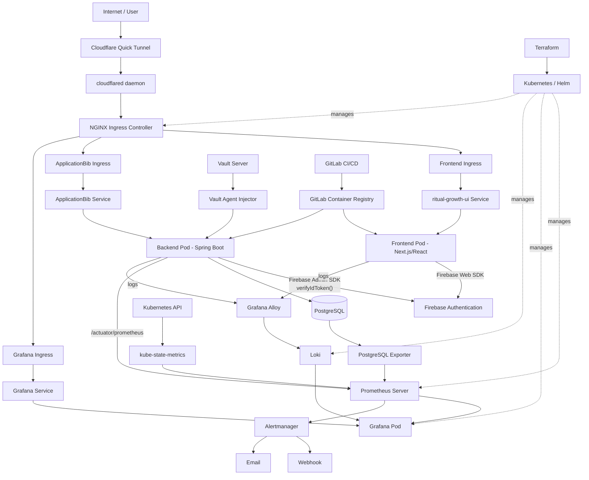
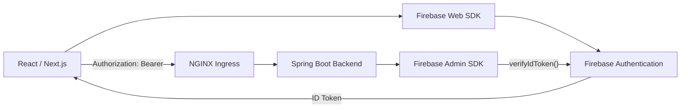
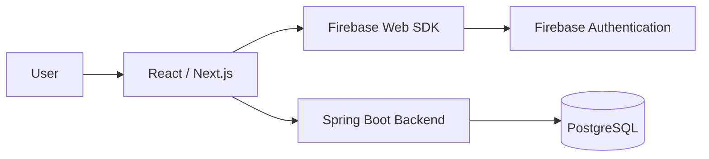
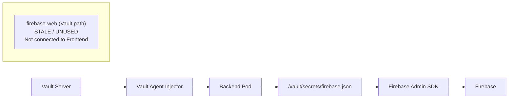
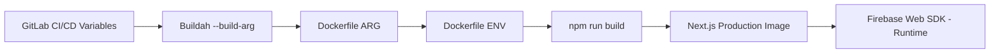
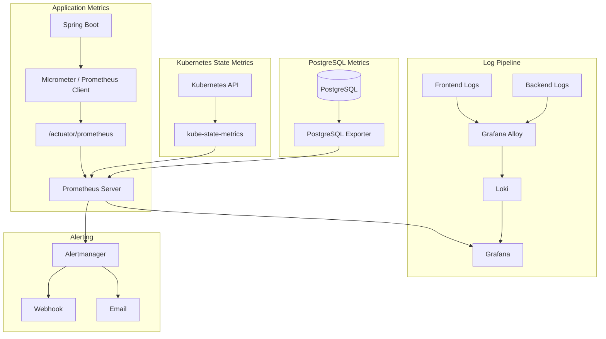
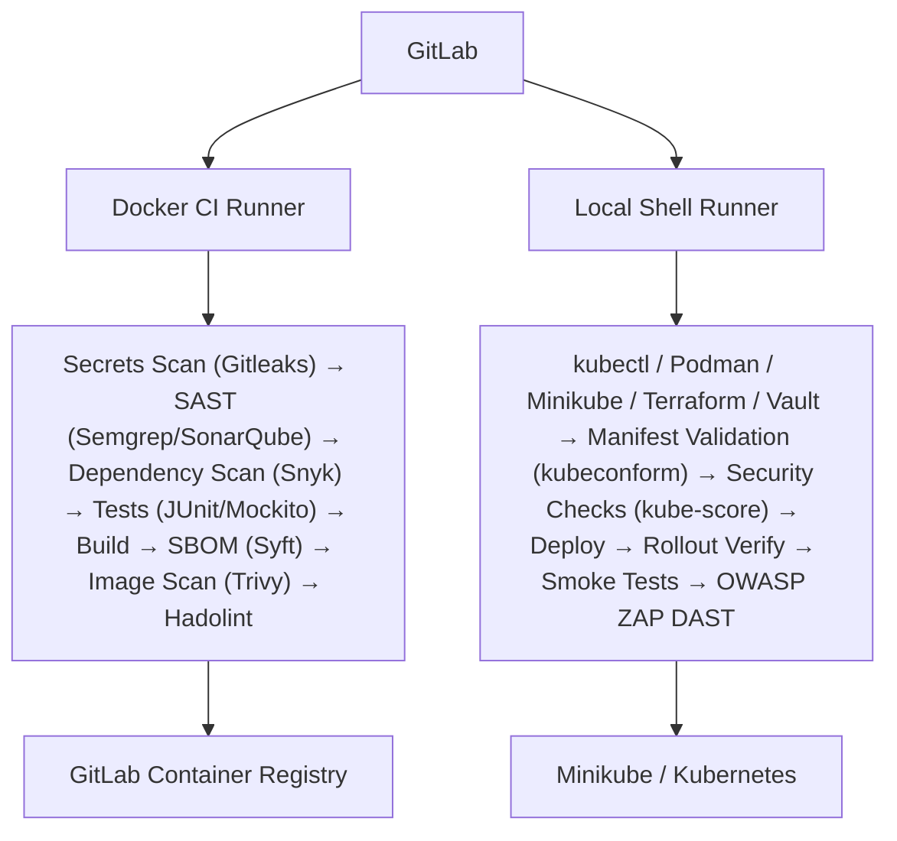
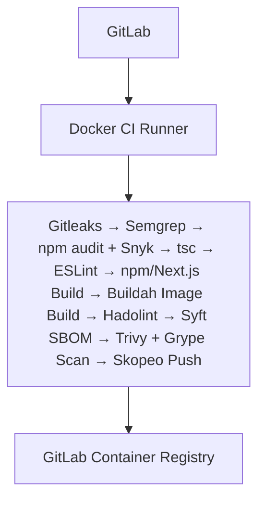
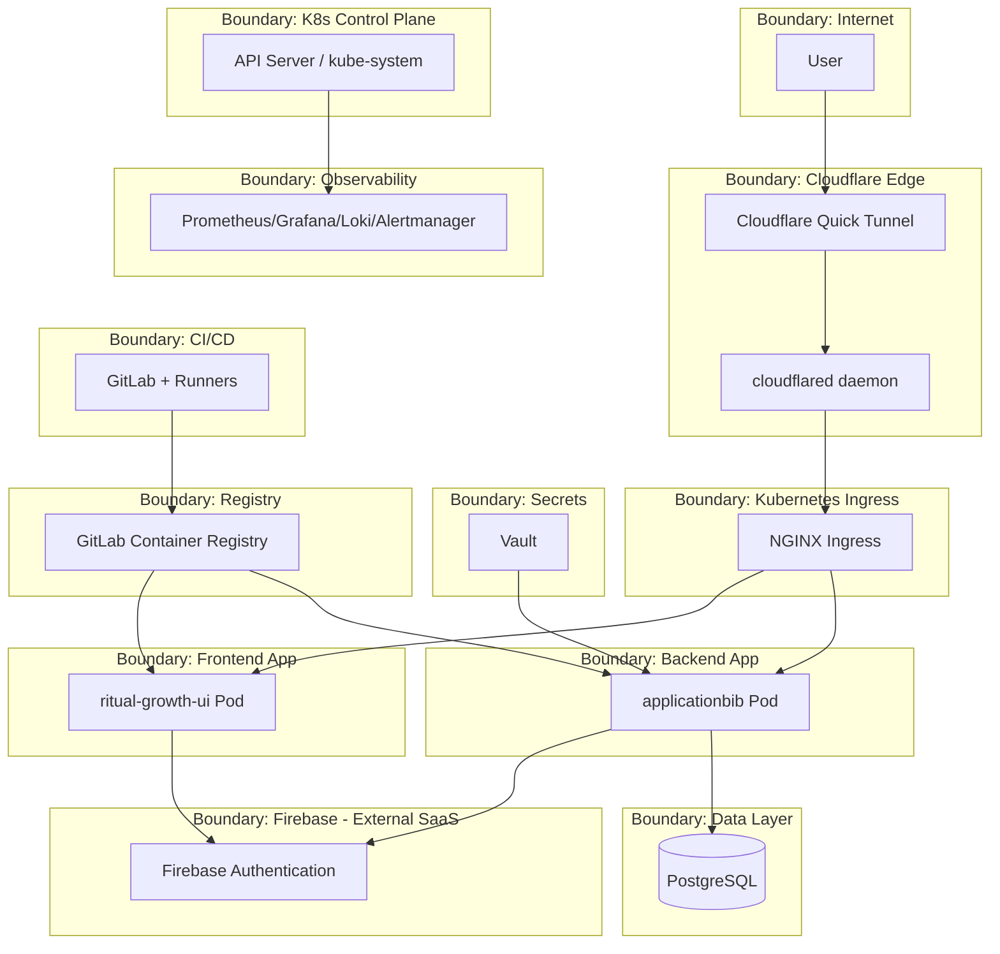

# Ritual Growth / ApplicationBib — DevSecOps Threat Model & Architecture Documentation

**Status:** Living document — reflects the *actual implemented system* as of this writing, not an idealized target architecture.

**Scope:** Frontend (`ritual-growth-ui`), Backend (`applicationbib`), Firebase Authentication, PostgreSQL, HashiCorp Vault, Kubernetes (Minikube), Cloudflare Quick Tunnel, monitoring/observability stack, CI/CD (GitLab), and Terraform-managed infrastructure.

---

## 1. System Overview

Ritual Growth is a two-service web application:

- **Frontend** — Next.js 15.3.3 / React 19 (`ritual-growth-ui`)
- **Backend** — Spring Boot (`applicationbib`)
- **Database** — PostgreSQL
- **Identity provider** — Firebase Authentication (Firebase Web SDK on the frontend, Firebase Admin SDK on the backend)
- **Orchestration** — Kubernetes via Minikube
- **Container tooling** — Podman / Buildah / Skopeo (daemonless, rootless build chain)
- **Ingress** — NGINX Ingress Controller
- **External access** — Cloudflare Quick Tunnel (via the `cloudflared` daemon, managed by its own script — not Terraform)
- **Secrets management** — HashiCorp Vault (Kubernetes auth method, Vault Agent Injector)
- **Observability** — Prometheus Client (Micrometer/Actuator) + Prometheus Server + kube-state-metrics + PostgreSQL Exporter + Grafana + Alertmanager + Grafana Alloy + Loki
- **CI/CD** — GitLab, separate frontend/backend pipelines, GitLab Container Registry
- **IaC** — Terraform

A recurring theme in this document: **Prometheus Client (instrumentation) and Prometheus Server are distinct components** and are never merged into a single "Prometheus" box.

---

## 2. Frontend Architecture

Repository: `ritual-growth-ui`
Stack: Next.js 15.3.3, React 19, Firebase Web SDK 11.9.1

`src/lib/firebase.ts` initializes the Firebase Web SDK using:

- `NEXT_PUBLIC_FIREBASE_API_KEY`
- `NEXT_PUBLIC_FIREBASE_AUTH_DOMAIN`
- `NEXT_PUBLIC_FIREBASE_PROJECT_ID`
- `NEXT_PUBLIC_FIREBASE_STORAGE_BUCKET`
- `NEXT_PUBLIC_FIREBASE_MESSAGING_SENDER_ID`
- `NEXT_PUBLIC_FIREBASE_APP_ID`

Firebase Authentication is used client-side for registration, login, auth-state tracking, ID token retrieval, and logout. The frontend obtains a token via `firebaseUser.getIdToken()` and sends it to the backend as:

```
Authorization: Bearer <Firebase ID token>
```

### 2.1 Important — Frontend Firebase Configuration Source

**The frontend does NOT receive Firebase Web configuration from Vault.** There is no `Vault → Vault Agent Injector → Frontend → Firebase Web` flow, and the `firebase-web` Vault path is not an active frontend dependency (see §6.1).

Production Firebase Web config flows through the build pipeline instead:

```
GitLab CI/CD Variables
  → Buildah --build-arg
    → Frontend Dockerfile ARG
      → Dockerfile ENV
        → npm run build
          → Next.js production image
            → React + Firebase Web SDK
              → Firebase Authentication
```

The frontend Dockerfile declares `ARG` entries for every `NEXT_PUBLIC_FIREBASE_*` value, converts them to `ENV`, and only then runs `npm run build`. GitLab CI passes these values in via `--build-arg`. `.env.local` is used only for local development.

**Build-time configuration** (`GitLab CI variables → Buildah --build-arg → Dockerfile → Next.js build`) is a distinct concern from **runtime Firebase usage** (`React/Next.js → Firebase Web SDK → Firebase Authentication`), and both are shown separately throughout this document.

**Not a confidentiality concern.** Because these are `NEXT_PUBLIC_*` values, Next.js bakes them into the client-side JavaScript bundle by design — they are visible to anyone who loads the app, the same way any Firebase Web SDK config is. They must **not** be treated or documented as confidential secrets, and their presence in GitLab CI/CD variables is a build-input concern, not a Vault-grade secret-custody concern. The actual security control that matters here is **Firebase project/API-key restrictions and Firebase Security Rules** (i.e., what an API key/project ID is allowed to do once known), not hiding the values from the browser.

---

## 3. Frontend Registration & Application Data Flow

Registration/authentication:

```
User → Next.js/React → Firebase Web SDK → Firebase Authentication
```

Application data (separate concern, separate system):

```
React/Next.js → Spring Boot Backend → PostgreSQL
```

Firebase Authentication is the identity system; PostgreSQL is the application data store. They are independent systems — Firebase credentials and Firebase service-account private keys are **never** stored in PostgreSQL.

---

## 4. Backend Architecture

Stack: Spring Boot, Maven, Spring Security, Firebase Admin SDK, PostgreSQL client, Spring Boot Actuator.

The backend receives `Authorization: Bearer <Firebase ID token>` from the frontend (via NGINX Ingress) and verifies it in a Firebase authentication filter using the Firebase Admin SDK:

```java
FirebaseAuth.getInstance().verifyIdToken(idToken)
```

Authentication flow:

```
Frontend → Firebase ID Token → NGINX Ingress → Spring Boot → Firebase Admin SDK → Firebase Authentication
```

Post-authentication data access:

```
Spring Boot → PostgreSQL
```

Requests with invalid/missing tokens are rejected per the implemented Spring Security configuration.

---

## 5. Vault Architecture

HashiCorp Vault runs inside Kubernetes with:

- Vault Server
- Vault Agent Injector
- Kubernetes auth method

The backend consumes an injected credential file:

```
FIREBASE_CREDENTIALS=/vault/secrets/firebase.json
```

This is the Firebase service-account credential for Firebase project `ritual-growth-ui-f7055`, injected by the Vault Agent Injector into the backend pod.

```
Vault Server → Vault Agent Injector → Backend Pod → /vault/secrets/firebase.json → Firebase Admin SDK → Firebase
```

No secret values are reproduced anywhere in this document. The Firebase service-account private key is **not** stored in the GitLab repository, the frontend, the browser, PostgreSQL, or any container image — only injected at runtime into the backend pod's filesystem by Vault.

### 5.1 Important Vault Distinction — `firebase-web`

A Vault path/secret named `firebase-web` may exist, but based on the current deployed state:

- The frontend Deployment has **no** Vault Agent annotations.
- The frontend pod has **no** `/vault/secrets` directory.
- The frontend receives Firebase config from GitLab CI/CD build arguments, not Vault.

**`firebase-web` is therefore an unused/stale Vault path, not an active architecture component.** It must not be drawn as `Vault → firebase-web → Frontend` in any production data flow.

---

## 6. Kubernetes Architecture

Platform: **Minikube**

Representative workloads:

- `applicationbib` (backend) Deployment
- `ritual-growth-ui` (frontend) Deployment
- PostgreSQL
- NGINX Ingress Controller
- Vault + Vault Agent Injector
- Prometheus, kube-state-metrics, PostgreSQL Exporter
- Grafana, Alertmanager
- Loki, Grafana Alloy

Namespaces: `default`, `monitoring`, `vault`, `ingress-nginx`, `kube-system`.

The Kubernetes control plane (API server, scheduler, controller-manager, `kube-system`) is treated as a distinct trust domain from application workloads running in `default`/`monitoring`/`vault`.

---

## 7. External Access — Cloudflare Quick Tunnel

```
External User → Cloudflare HTTPS (edge) → Cloudflare Quick Tunnel → cloudflared → Minikube → NGINX Ingress Controller → Kubernetes Services → Frontend/Backend/Grafana
```

`cloudflared` is the local daemon that establishes and maintains the outbound connection from the Minikube host to Cloudflare's edge for the Quick Tunnel — it is a distinct runtime component from the Quick Tunnel itself and is started/managed by its own documented script (see §10; Terraform does not manage it).

The Cloudflare Quick Tunnel exposes the local Minikube ingress externally without directly exposing a backend NodePort to the public Internet. Cloudflare is purely a network-edge/tunneling component — it performs **no** Firebase application authentication. Firebase Authentication remains the sole application-level authentication mechanism.

---

## 8. NGINX Ingress Routing

```
Cloudflare Quick Tunnel → NGINX Ingress Controller → ApplicationBib Ingress → ApplicationBib Service → ApplicationBib Pod
Cloudflare Quick Tunnel → NGINX Ingress Controller → Frontend Ingress → ritual-growth-ui Service → ritual-growth-ui Pod
Cloudflare/internal access → NGINX Ingress Controller → Grafana Ingress → Grafana Service → Grafana Pod
```

NGINX performs HTTP(S) routing only; it does not authenticate Firebase users.

---

## 9. Monitoring & Observability Architecture

Each telemetry pipeline below is independent and is never collapsed into a single generic "monitoring" arrow.

### 9.1 Application Metrics (Prometheus Client vs. Prometheus Server)

The Spring Boot backend uses **Micrometer / Spring Boot Actuator Prometheus support** — this is the Prometheus **client**/instrumentation side, living *inside* the application:

```
Spring Boot Application → Micrometer / Prometheus instrumentation → /actuator/prometheus
```

The Prometheus **Server** (a separate Kubernetes-deployed component) scrapes this endpoint, stores time series, and evaluates alerting rules:

```
/actuator/prometheus → Prometheus Server
```

Prometheus Server is never embedded inside Spring Boot, and the instrumentation endpoint is never called "the Prometheus Server."

### 9.2 Kubernetes State Metrics

```
Kubernetes API → kube-state-metrics → Prometheus Server
```

kube-state-metrics exposes pod/deployment/replica/readiness/restart/resource-state information — it is not Prometheus itself.

### 9.3 Frontend Monitoring

The frontend has no custom `/metrics` endpoint scraped by Prometheus Server. What is confirmed is Node.js process-level telemetry surfaced for the `ritual-growth-ui` pod:

- CPU usage
- Memory usage
- Node.js heap used
- Node.js heap total
- Event-loop lag
- Active Node.js handles
- Active Node.js requests

A Terraform-provisioned Grafana dashboard for `ritual-growth-ui` contains **seven panels**, one per metric above. There is currently no confirmed request-rate or error-rate metric for the frontend; that wording has been removed and should only be reinstated if findings/configuration later prove such metrics exist.

### 9.4 PostgreSQL Metrics

```
PostgreSQL → PostgreSQL Exporter → Prometheus Server → Grafana
```

PostgreSQL never sends metrics directly to Grafana.

### 9.5 Grafana

```
Prometheus Server → Grafana
Loki → Grafana
```

Grafana dashboards cover backend metrics, frontend infrastructure metrics, PostgreSQL metrics, Kubernetes metrics, and logs (via Loki). The `ritual-growth-ui` seven-panel dashboard is provisioned/managed by Terraform.

### 9.6 Alertmanager

```
Prometheus Server → Alertmanager → Webhook
Prometheus Server → Alertmanager → Email
```

Alertmanager performs routing, grouping, and notification delivery. It does not generate application metrics, and Prometheus never emails directly — Alertmanager mediates all notification delivery.

### 9.7 Grafana Alloy & Loki (Logs)

```
Frontend container logs → Grafana Alloy → Loki
Backend container logs → Grafana Alloy → Loki
Loki → Grafana
```

**Prometheus = metrics. Loki = logs.** Loki never stores Prometheus time series; Prometheus never stores application logs. Alloy is a distinct log-shipping component, not the Prometheus Server.

### 9.8 Consolidated Observability Pipelines

| Pipeline | Flow |
|---|---|
| Application metrics | Spring Boot → Micrometer/Prometheus Client → `/actuator/prometheus` → Prometheus Server → Grafana |
| Kubernetes state metrics | Kubernetes API → kube-state-metrics → Prometheus Server → Grafana |
| PostgreSQL metrics | PostgreSQL → PostgreSQL Exporter → Prometheus Server → Grafana |
| Container logs | Frontend + Backend containers → Grafana Alloy → Loki → Grafana |
| Alerts | Prometheus Server → Alertmanager → Webhook / Email |

---

## 10. Terraform / Infrastructure as Code

Terraform manages Kubernetes resources, Helm releases, the NGINX ingress release, the kube-prometheus-stack, Loki, Grafana configuration/dashboards, ServiceMonitors, and general monitoring configuration:

```
Terraform → Kubernetes/Helm → Infrastructure + Monitoring Stack
```

Terraform is infrastructure-as-code applied out-of-band from request traffic — it is **not** a runtime dependency of the frontend or backend.

**Terraform does not manage the Cloudflare Quick Tunnel.** The tunnel (and the `cloudflared` process that maintains it — see §7) is started and managed by its own separate, documented script, outside of Terraform's scope. Terraform's remit is limited to the Kubernetes/Helm-deployed resources listed above; it must not be drawn or described as provisioning or controlling the Quick Tunnel.

---

## 11. Backend CI/CD Architecture

Two GitLab runner types are used.

### 11.1 Docker CI Runner (build/security validation)

Executor: **Docker**
Tools: Maven, JUnit, Mockito, Gitleaks, Semgrep, SonarQube, Snyk, Syft, Trivy, Hadolint

```
GitLab → Docker CI Runner → Build/Security Validation → GitLab Container Registry
```

### 11.2 Local Kubernetes Shell Runner (deploy/runtime verification)

Executor: **Shell**
Tools: kubectl, Podman, Minikube, Terraform, Vault, Kubernetes rollout checks, smoke tests, OWASP ZAP, Prometheus/Grafana verification

```
GitLab → Local Shell Runner → Minikube/Kubernetes
```

### 11.3 Backend Pipeline Stages

1. Secrets scanning (Gitleaks)
2. SAST (Semgrep, SonarQube)
3. Dependency scanning (Snyk)
4. Unit/integration tests (JUnit, Mockito, Maven)
5. Linting
6. Build
7. SBOM generation (Syft)
8. Container image scanning (Trivy)
9. Kubernetes manifest validation (kubeconform)
10. Kubernetes security validation (kube-score)
11. Pre-deployment checks
12. Deployment
13. Rollout verification
14. Post-deployment smoke tests
15. OWASP ZAP DAST

---

## 12. Frontend CI/CD Architecture

Executor: **Docker**. Build tooling is daemonless/container-based: Buildah, Podman, Skopeo.

| Stage | Tool |
|---|---|
| Secrets scanning | Gitleaks |
| SAST | Semgrep |
| Dependency scanning | npm audit + Snyk |
| Typecheck | `tsc` |
| Lint | ESLint |
| Build | npm / Next.js |
| Image build | Buildah |
| Dockerfile linting | Hadolint |
| SBOM | Syft |
| Image scanning | Trivy + Grype |
| Image push | Skopeo |

### 12.1 Frontend Firebase CI/CD Configuration (explicit)

```
GitLab CI/CD Variables → Buildah --build-arg → Dockerfile ARG → Dockerfile ENV → npm run build → Next.js production image → React + Firebase Web SDK → Firebase Authentication
```

Vault and the Vault Agent Injector are **not** part of this flow, and `firebase-web` is **not** an active dependency in it.

---

## 13. Container Registry

```
GitLab CI → Buildah → Container Image → GitLab Container Registry
GitLab Container Registry → Kubernetes → Backend Pod
GitLab Container Registry → Kubernetes → Frontend Pod
```

---

## 14. Complete Runtime Authentication Flow

```
User → React/Next.js → Firebase Web SDK → Firebase Authentication → (Firebase ID Token)
Frontend → Authorization: Bearer <Firebase ID Token> → NGINX Ingress → Spring Boot Backend → Firebase Admin SDK → Firebase Authentication
```

Verification: `FirebaseAuth.getInstance().verifyIdToken(idToken)`. Invalid/missing tokens are rejected per the implemented Spring Security configuration.

```
Spring Boot → PostgreSQL
```

---

## 15. Trust Boundaries

1. Internet / external user
2. Cloudflare edge/tunnel
3. Kubernetes ingress (NGINX)
4. Frontend application (`ritual-growth-ui` pod)
5. Backend application (`applicationbib` pod)
6. Firebase managed services (external SaaS)
7. PostgreSQL
8. Vault
9. Kubernetes control plane
10. Monitoring/observability stack
11. GitLab CI/CD
12. Container registry
13. CI runners (Docker executor / local Shell executor)

---

## 16. Sensitive Assets

- Firebase service-account credentials (`/vault/secrets/firebase.json`)
- Firebase ID tokens
- User authentication information
- PostgreSQL application data
- Vault secrets (including the stale `firebase-web` path)
- GitLab CI/CD variables (build/deploy credentials, registry tokens, etc.)

**Not treated as a confidential asset:** the `NEXT_PUBLIC_FIREBASE_*` Web config values. They are passed through GitLab CI/CD as build arguments, but they end up embedded in the public client bundle by design and are not secrets — see §2.1. They are listed here only for completeness of the CI/CD variable inventory, not because they require secrecy; the relevant control is Firebase project/API-key restriction, tracked separately.
- Container registry credentials
- Kubernetes credentials (kubeconfig, service account tokens)
- CI runner credentials
- Monitoring data (metrics, dashboards)
- Application logs (Loki)
- Alert notification endpoints (webhook URL, email config)
- Terraform state/configuration

No credentials, tokens, private keys, or secret values are reproduced in this document.

---

## 17. Required Diagrams

### A. Complete System Architecture



### B. Authentication Architecture



### C. Registration Architecture



### D. Vault Architecture



### E. Frontend Build Configuration



### F. Monitoring Architecture



### G. Backend CI/CD



### H. Frontend CI/CD



### I. Trust Boundary Diagram



---

## 18. Component Table

| Component | Technology | Role | Data Handled | Trust Boundary | Security Relevance |
|---|---|---|---|---|---|
| Frontend app | Next.js 15.3.3 / React 19 | User-facing UI, auth initiation | UI state, Firebase ID token (in-browser) | Frontend application | XSS, token handling, build-arg secret exposure |
| Firebase Web SDK | Firebase JS SDK 11.9.1 | Client-side auth calls | Firebase API key, auth tokens | Frontend / Firebase boundary | Public API key exposure is expected but must be scoped correctly |
| Firebase Authentication | Firebase (SaaS) | Identity provider | Credentials, ID tokens | Firebase managed services | External dependency; token forgery/replay risk if mishandled |
| Backend app | Spring Boot / Maven | API, business logic, token verification | Firebase ID tokens, app data | Backend application | Central enforcement point for authZ/authN |
| Firebase Admin SDK | Firebase Admin (Java) | Server-side token verification | Firebase service-account credential | Backend / Firebase boundary | Credential compromise = full auth bypass capability |
| PostgreSQL | PostgreSQL | Application data store | User/application records | Data layer | SQLi, data exposure, backup handling |
| Vault Server | HashiCorp Vault | Secrets management | Firebase service-account JSON | Secrets boundary | Central secret custody; policy misconfig risk |
| Vault Agent Injector | Vault K8s Injector | Sidecar-based secret injection | Injected secret files | Secrets boundary / Backend | Injector misconfig could leak secrets to wrong pod |
| NGINX Ingress | NGINX Ingress Controller | L7 routing into cluster | HTTP(S) traffic, TLS termination (if configured) | Ingress boundary | Misrouting, ingress misconfig, TLS handling |
| Cloudflare Quick Tunnel | Cloudflare Tunnel | External edge/tunnel | All inbound HTTP traffic | Internet / Cloudflare boundary | Tunnel token compromise, lack of edge auth in current setup |
| `cloudflared` daemon | Cloudflare Tunnel client | Maintains outbound tunnel connection from Minikube host to Cloudflare edge | All inbound HTTP traffic (in transit) | Cloudflare edge / Minikube host boundary | Host-level process compromise would expose the tunnel; managed by its own script, not Terraform |
| Prometheus Client (Micrometer) | Micrometer / Actuator | Metrics instrumentation | Internal app metrics | Backend application | Endpoint exposure if unauthenticated |
| Prometheus Server | Prometheus | Metrics scrape/store/alert-eval | Time-series metrics | Monitoring boundary | Unauthorized scrape/query access |
| kube-state-metrics | kube-state-metrics | K8s object state metrics | Cluster object metadata | Monitoring boundary / K8s API | Exposes cluster topology info |
| PostgreSQL Exporter | postgres_exporter | DB metrics exposition | DB performance metrics | Monitoring boundary | Could leak query/perf metadata |
| Grafana | Grafana | Dashboards/visualization | Metrics + logs (via datasources) | Monitoring boundary | Dashboard/auth access control |
| Alertmanager | Alertmanager | Alert routing/notification | Alert payloads | Monitoring boundary | Webhook/email endpoint exposure |
| Grafana Alloy | Grafana Alloy | Log collection agent | Container log streams | Monitoring boundary | Log tampering/interception in transit |
| Loki | Loki | Log aggregation/storage | Application/container logs | Monitoring boundary | Sensitive data leakage via logs |
| GitLab CI/CD | GitLab | Pipeline orchestration | Source code, CI variables, secrets | CI/CD boundary | Variable exposure, pipeline injection |
| GitLab Container Registry | GitLab Registry | Image storage | Built container images | Registry boundary | Image tampering, unauthorized pull/push |
| Docker CI Runner | Docker executor | Build & security validation | Source code, build artifacts | CI runner boundary | Compromised runner = supply chain risk |
| Local Shell Runner | Shell executor | Deploy & runtime verification | kubeconfig, Vault tokens, Terraform state | CI runner boundary | Broadest blast radius — direct cluster/Vault access |
| Terraform | Terraform | Infrastructure as code | Infra/monitoring configuration, state | IaC boundary | State file sensitivity, drift, apply permissions |

---

## 19. Data Flow Table

| Flow | Source | Destination | Data | Purpose | Trust Boundary Crossed |
|---|---|---|---|---|---|
| 1 | User | Cloudflare Quick Tunnel | HTTP(S) request | Access app | Internet → Cloudflare edge |
| 2 | Cloudflare Quick Tunnel | `cloudflared` daemon | Tunneled HTTP(S) | Forward to Minikube host | Cloudflare edge → Minikube host |
| 3 | `cloudflared` daemon | NGINX Ingress | Tunneled HTTP(S) | Route to cluster | Minikube host → Ingress |
| 4 | NGINX Ingress | Frontend Pod | HTTP request | Serve UI | Ingress → Frontend app |
| 5 | Frontend | Firebase Authentication | Credentials / ID token requests | Authenticate user | Frontend → Firebase (external) |
| 6 | Frontend | Backend | Bearer ID token + app request | Access application API | Frontend → Backend app |
| 7 | Backend | Firebase Authentication | ID token verification request | Validate identity | Backend → Firebase (external) |
| 8 | Backend | PostgreSQL | SQL queries | Persist/retrieve app data | Backend → Data layer |
| 9 | Vault | Backend | `firebase.json` service-account credential | Enable Firebase Admin SDK | Secrets boundary → Backend |
| 10 | Backend (`/actuator/prometheus`) | Prometheus Server | Metrics scrape | Observability | Backend → Monitoring |
| 11 | PostgreSQL | PostgreSQL Exporter | DB stats | Observability | Data layer → Monitoring |
| 12 | Kubernetes API | kube-state-metrics | Cluster object state | Observability | K8s control plane → Monitoring |
| 13 | Grafana Alloy | Loki | Log lines | Log aggregation | App/K8s → Monitoring |
| 14 | Prometheus Server | Grafana | Metric queries | Visualization | Monitoring internal |
| 15 | Prometheus Server | Alertmanager | Fired alerts | Alert routing | Monitoring internal |
| 16 | Alertmanager | Webhook endpoint | Alert notification | External notification | Monitoring → External system |
| 17 | Alertmanager | Email | Alert notification | External notification | Monitoring → External system |
| 18 | GitLab | CI Runners (Docker/Shell) | Pipeline jobs, CI variables | Build/test/deploy | CI/CD boundary |
| 19 | CI (Docker Runner) | GitLab Container Registry | Built container image | Store artifact | CI/CD → Registry |
| 20 | GitLab Container Registry | Kubernetes (Backend/Frontend pods) | Container image pull | Deploy workload | Registry → Runtime |

---

## 20. STRIDE Threat Table

| Component | Spoofing | Tampering | Repudiation | Information Disclosure | Denial of Service | Elevation of Privilege |
|---|---|---|---|---|---|---|
| Frontend | Malicious client impersonating legitimate UI (phishing clone) | Client-side JS tampering, compromised build-arg values | Limited client-side logging | Firebase config values (public by design) exposed in bundle; risk if API key restrictions are weak | Client-side resource exhaustion (browser only) | N/A (no privileged frontend context) |
| Firebase Authentication | Credential stuffing, token replay | N/A (managed by Firebase) | Firebase-side audit logs (external, limited visibility) | ID token leakage via logs/URLs/referrers | Firebase-side rate limiting (external control) | Improper custom claims usage could over-privilege a user |
| Firebase Web SDK | N/A (library) | Supply-chain tampering of SDK package | N/A | Overly permissive Firebase security rules if misconfigured | N/A | N/A |
| Backend | Forged/replayed ID tokens if verification skipped | Manipulated request payloads if input validation weak | Lack of structured request/audit logging | Verbose error responses leaking internals | Unbounded/expensive endpoints without rate limiting | Broken authorization allowing horizontal/vertical privilege escalation |
| Firebase Admin SDK | N/A (library) | Tampered service-account credential file | N/A | Service-account credential disclosure = full admin capability | N/A | Compromised credential grants full Firebase project admin rights |
| PostgreSQL | Unauthorized DB connection if credentials leak | SQL injection, unauthorized writes | Lack of DB-level audit logging | Data exfiltration via injection or over-broad grants | Expensive/unbounded queries, connection exhaustion | Overly broad DB role/grant escalation |
| Vault | Unauthorized pod impersonating backend service account | Policy misconfiguration allowing secret overwrite | Vault audit logging not yet centralized (see §21) | Overly broad Vault policy exposing unrelated secrets | Vault unavailability blocking secret retrieval on pod (re)start | Excessive Vault policy scope granting unintended secret access |
| Vault Agent Injector | Malicious pod requesting injection via spoofed K8s SA | Sidecar/init-container tampering | Injector logs not centrally aggregated | Secret written to wrong/compromised pod filesystem | Injector failure blocking pod startup | Overly permissive injector RBAC |
| Kubernetes (Minikube) | Compromised kubeconfig/service account token | Unauthorized manifest/resource modification | Limited K8s audit logging in Minikube by default | Secrets/ConfigMaps readable by over-privileged pods | Resource exhaustion without limits/quotas | Weak RBAC allowing namespace/cluster-level escalation |
| NGINX Ingress | Host header spoofing, ingress rule confusion | Ingress annotation tampering | Access logs may be incomplete | Misrouted requests exposing internal services | Connection flood at ingress layer | Ingress controller RBAC over-scoped |
| Cloudflare Quick Tunnel | No app-level auth at edge — anyone reaching the tunnel URL reaches ingress | Tunnel config tampering (out of cluster scope) | Cloudflare-side logs (external, limited visibility) | Quick Tunnel URLs are ephemeral but discoverable if leaked | Tunnel-level throttling (Cloudflare-managed) | N/A — tunnel does not perform app authorization |
| Prometheus Client / Micrometer | N/A (library) | Metric value manipulation from compromised app process | N/A | Unauthenticated `/actuator/prometheus` exposing internal metrics/paths | Expensive metric cardinality causing scrape/storage strain | N/A |
| Prometheus Server | Spoofed scrape targets if ServiceMonitor misconfigured | Metric injection from untrusted target | Limited query audit logging | Unauthenticated Prometheus UI/API exposing all metrics | High-cardinality metrics causing storage exhaustion | Broad RBAC on Prometheus service account |
| kube-state-metrics | N/A | N/A (read-only) | N/A | Exposes cluster topology/metadata to any consumer with scrape access | Scrape-induced API server load | Read-only K8s API access if over-scoped |
| PostgreSQL Exporter | Spoofed exporter target | N/A (read-only) | N/A | DB connection string/credentials exposure if misconfigured | Exporter query load on DB | Exporter DB role broader than required |
| Grafana | Weak/default Grafana credentials | Dashboard/datasource tampering by unauthorized user | Grafana access logs (if enabled) | Dashboards exposing sensitive metrics/logs to unauthorized viewers | Expensive dashboard queries | Grafana admin role over-assignment |
| Alertmanager | Spoofed alert source | Alert rule/config tampering | No confirmation of notification delivery | Alert content may contain sensitive labels/annotations | Alert flood / notification spam | Overly broad Alertmanager config access |
| Grafana Alloy | Spoofed log source | Log stream tampering in transit | Gaps in log collection reduce forensic capability | Sensitive data (tokens, PII) leaking into logs | Log volume overwhelming Loki ingestion | Alloy service account over-permissioned |
| Loki | N/A (ingestion only) | Log tampering pre-ingestion | Incomplete retention reducing investigative capability | Sensitive log content readable by broad Grafana access | Ingestion overload from log floods | Loki datasource permissions over-scoped in Grafana |
| GitLab CI/CD | Compromised GitLab account/token | Pipeline definition tampering (`.gitlab-ci.yml`) | Pipeline logs generally available (positive control) | CI/CD variables (deploy credentials, registry tokens) exposure via misconfigured jobs — Firebase Web config values are excluded, as they are non-confidential by design (see §2.1) | Pipeline/runner resource exhaustion | Overly broad CI variable scope/protected-branch bypass |
| Container Registry | Spoofed/typo-squatted image push | Image tampering post-scan, pre-deploy | Registry access logs (if enabled) | Registry credential leakage exposing all images | Registry unavailability blocking deploys | Overly broad registry push/pull permissions |
| Docker CI Runner | Compromised runner registration token | Malicious job tampering build output | Job logs (positive control) | Build secrets exposed via job logs/artifacts | Runner resource exhaustion from malicious jobs | Runner service account broader than build needs |
| Local Shell Runner | Compromised host running the shell runner | Direct host-level tampering (broadest blast radius) | Local execution may lack centralized logging | Runner has direct access to kubeconfig, Vault tokens, Terraform state | Local resource exhaustion affecting Minikube host | Runner has broad local privileges — highest escalation risk in the system |
| Terraform | Spoofed state backend (if remote backend used) | State/config tampering | Apply history not centrally audited | Terraform state may contain sensitive infra values | N/A (control-plane tool, not runtime) | Terraform apply credentials often broadly scoped |

---

## 21. Security Control Mapping

| Threat | Existing Control | Status | Residual Risk | Recommended Improvement |
|---|---|---|---|---|
| Forged/invalid ID tokens reaching backend | Firebase ID-token verification via Admin SDK (`verifyIdToken`) | Implemented | Low, assuming clock skew/revocation handled by SDK defaults | — |
| Firebase service-account credential exposure | Vault-managed credential injected only into backend pod via Vault Agent Injector | Implemented | Compromise of backend pod still exposes credential in-memory/on-disk | Tighter pod security context, shorter secret TTL/rotation |
| Vault access from arbitrary workloads | Kubernetes auth method scoping Vault access | Implemented | Overly broad Vault policy could still grant unintended access | Tighter, least-privilege Vault policies (see recommendations) |
| Secrets committed to source | Gitleaks in both pipelines | Implemented | Detects only what patterns are configured for | Expand/rotate detection rules periodically |
| Vulnerable/insecure code patterns | Semgrep, SonarQube | Implemented | False negatives on novel patterns | Periodic rule tuning |
| Vulnerable dependencies | Snyk (backend & frontend), npm audit (frontend) | Implemented | New CVEs post-scan until next run | Scheduled re-scans / dependency-update automation |
| Insecure Dockerfiles | Hadolint | Implemented | Doesn't catch runtime misconfig | Combine with runtime policy enforcement |
| Unknown SBOM composition | Syft | Implemented | SBOM freshness depends on pipeline run | Attach SBOM to registry as attestation |
| Vulnerable container images | Trivy (both), Grype (frontend) | Implemented | Zero-day/unscanned-layer risk | Add image signing/verification (Cosign/Sigstore) |
| Invalid/insecure K8s manifests | kubeconform, kube-score | Implemented | Static checks only, not runtime enforcement | Add admission-control policy enforcement |
| Runtime application vulnerabilities | OWASP ZAP DAST | Implemented | Scans pre-production surface only | Extend DAST coverage to authenticated flows |
| Unauthorized public exposure of backend | Cloudflare Quick Tunnel instead of public NodePort | Implemented | Tunnel URL itself has no app-level auth at the edge | Cloudflare Access or stronger edge auth for non-dev environments (Recommended / Not implemented) |
| Metrics/logs pipeline confusion or single point of failure | Clear separation: Prometheus (metrics) vs. Loki (logs); Client vs. Server distinction maintained | Implemented | N/A architecturally; access control to these systems still open | Prometheus/Grafana access controls (Recommended / Not implemented) |
| Overly broad network access between workloads | — | Recommended / Not implemented | Lateral movement possible within cluster | Stricter NetworkPolicies |
| Overly broad Kubernetes RBAC | — | Recommended / Not implemented | Elevation of privilege via over-scoped roles | Tighter Kubernetes RBAC |
| Broad blast radius of local Shell CI runner | — | Recommended / Not implemented | Single compromised runner has direct Vault/K8s/Terraform access | Dedicated least-privilege CI service accounts; reduce Shell runner scope |
| Lack of centralized Vault audit trail | — | Recommended / Not implemented | Delayed detection of Vault misuse | Vault audit logging and centralized audit analysis |
| Unrestricted access to monitoring UIs | — | Recommended / Not implemented | Sensitive metrics/logs viewable by any cluster-internal actor | Access controls on Prometheus/Grafana |
| No rate limiting at ingress/application layer | — | Recommended / Not implemented | Susceptible to abuse/DoS | Rate limiting at NGINX/application layer |
| Unsigned container images | — | Recommended / Not implemented | Supply-chain tampering between build and deploy | Image signing/verification via Cosign/Sigstore |
| Limited CI/CD provenance | — | Recommended / Not implemented | Harder to prove build integrity | Improved CI provenance/attestation |
| Fragmented security event visibility | — | Recommended / Not implemented | Slower incident detection/response | Centralized security event monitoring, stronger audit logging |

---

## 22. Residual Risks & Future Recommendations *(Not currently implemented)*

- Cloudflare Access or stronger edge authentication for non-development environments
- Stricter Kubernetes NetworkPolicies between namespaces/workloads
- Tighter, least-privilege Vault policies
- Tighter Kubernetes RBAC
- Dedicated least-privilege CI service accounts (especially for the local Shell runner)
- Reducing the blast radius of the local Shell runner
- Vault audit logging and centralized audit analysis
- Access controls on Prometheus/Grafana
- Rate limiting at ingress/application layer
- Image signing and verification (Cosign/Sigstore)
- Improved CI/CD provenance and build attestation
- Stronger, centralized audit logging
- Centralized security event monitoring

These are explicitly **future work**, not implemented controls.

---

## 23. Final Summary

1. **Reaching the system:** Users reach Ritual Growth over the Internet via a Cloudflare Quick Tunnel, which forwards traffic to the NGINX Ingress Controller inside the Minikube cluster; NGINX routes requests to the frontend, backend, or Grafana Services based on ingress rules.
2. **Firebase authentication:** The frontend uses the Firebase Web SDK for registration, login, and session/token management; the backend independently verifies each request's Firebase ID token server-side via the Firebase Admin SDK (`verifyIdToken`).
3. **Frontend configuration:** Production Firebase Web configuration values are injected at **build time** through GitLab CI/CD variables, passed to Buildah as `--build-arg`s, converted to Dockerfile `ARG`/`ENV`, and baked into the Next.js production image — Vault plays no role in this path.
4. **Backend credential protection:** The backend's Firebase service-account credential is managed by HashiCorp Vault and injected at runtime into the backend pod (`/vault/secrets/firebase.json`) via the Vault Agent Injector, using Kubernetes auth — never checked into source, never present in the frontend or PostgreSQL.
5. **Application data:** After authentication, the backend reads/writes application data directly to PostgreSQL — a system entirely separate from Firebase identity data.
6. **Metrics:** Application metrics flow from Micrometer/Actuator (`/actuator/prometheus`) to the Prometheus Server; Kubernetes state metrics flow via kube-state-metrics; PostgreSQL metrics flow via the PostgreSQL Exporter — all converging on Prometheus Server, then Grafana.
7. **Logs:** Frontend and backend container logs are shipped by Grafana Alloy into Loki, which Grafana queries separately from metrics.
8. **Alerts:** Prometheus Server evaluates alerting rules and hands fired alerts to Alertmanager, which routes notifications to a webhook and/or email — Prometheus never notifies directly.
9. **Terraform:** Terraform manages Kubernetes/Helm-deployed infrastructure and monitoring configuration (ingress, kube-prometheus-stack, Loki, Grafana dashboards, ServiceMonitors) as infrastructure-as-code, independent of runtime application traffic.
10. **CI/CD supply chain security:** The backend pipeline runs on a Docker CI runner (secrets/SAST/dependency/test/build/SBOM/image scanning) and a local Shell runner (deploy, manifest/security validation, smoke tests, DAST); the frontend pipeline runs a Docker-based Buildah/Podman/Skopeo chain with equivalent secrets/SAST/dependency/typecheck/lint/build/image-scan/push stages.
11. **Implemented controls:** Firebase ID-token auth and server-side verification, Vault-managed backend credentials via Kubernetes auth and the Agent Injector, secrets/SAST/dependency/container scanning (Gitleaks, Semgrep, SonarQube, Snyk, Trivy, Grype, Syft), Dockerfile linting (Hadolint), Kubernetes manifest/security validation (kubeconform, kube-score), OWASP ZAP DAST, the full Prometheus/kube-state-metrics/PostgreSQL-Exporter/Grafana/Alertmanager/Alloy/Loki observability stack, Terraform-managed monitoring, and Cloudflare Quick Tunnel in place of direct NodePort exposure.
12. **Future work:** Edge authentication hardening, NetworkPolicies, tighter Vault/K8s RBAC, reduced CI runner blast radius, Vault audit logging, monitoring access controls, rate limiting, image signing/attestation, and centralized security event monitoring remain **recommended, not implemented**.

---

*This document intentionally represents the system as actually deployed. Components, flows, or controls not described above (including the stale `firebase-web` Vault path as an active frontend dependency) are explicitly excluded to avoid misrepresenting the architecture.*
